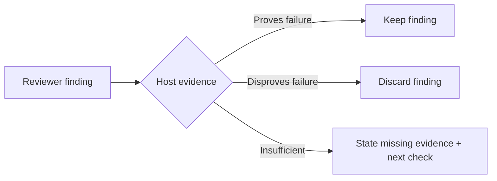

# Independent challenge

Apply only to an explicitly requested independent/adversarial review. The reviewer is the other agent: Claude Code work is challenged by Codex, Codex work by Claude Code, picked from the running host. Run `python3 .hooks/hard-eng.py challenge [--base <ref>]`; it calls the other CLI read-only with its default model and records the outcome for HEAD (`findings`, `clean` or `not done: <reason>`). Pass `--host claude|codex` only when the host cannot be detected. If the review is not done, report that limit rather than label a self-review independent.

- Brief = accepted outcome + exact artifact/revision + constraints + owner/caller pointers + actual proof + unknowns. Provide enough context to test claims; omit author identity, previous verdicts and rebuttals that could bias the reviewer.
- Assignment = inspect without editing; reconstruct the intended outcome and try to disprove material claims. Seek a competing cause, missed caller, boundary/retry failure, weak test or simpler existing owner where relevant. Use the shared finding format; no mandatory checklist of unrelated concerns.
- Host = verify returned findings against source and, where useful, the cheapest discriminating check. Reviewer confidence and consensus are not proof. Only verified findings enter the defect list; preserve consequential unknowns as verification gaps.

