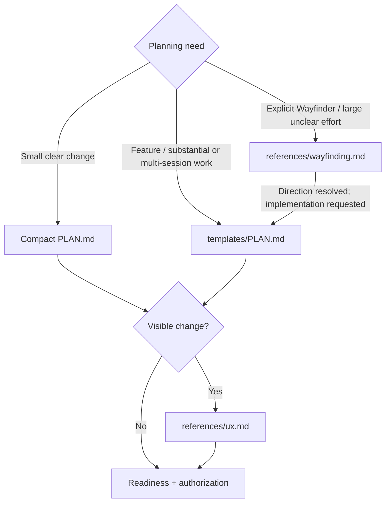

# Hard Eng Plan

- Output = ready plan + UX reference when applicable + baseline evidence + execution recommendation + authorization boundary, or explicit blocking decisions. Planning may produce the plan, research + isolated previews; production implementation waits for readiness + authorization.
- Context = [Hard Eng workflow](../he/references/workflow.md). Reuse current repository evidence + settled decisions; load [Research](../research/SKILL.md) or [Codebase Design](../codebase-design/SKILL.md) only when needed.

## Routes

Select from the user's intent + actual scope, not a keyword alone. Existing ready plan → continue within its authorization; material change → reopen only the affected decision.

## Plan + questions

- Both sizes = [PLAN.md](templates/PLAN.md), short entries for small work; one plan per effort at root or `features/<slug>/PLAN.md` (filename case-insensitive). Reuse the same plan. Fill every section; `N/A — reason` must explain inapplicability from repository facts. Unavailable tools, failed checks + missing proof are blockers, never N/A.
- Questions = inspect repository facts first; ask only user-dependent choices that can change outcome, UX, scope or material risk. Resolve prerequisite choices first; batch independent questions with a recommendation + consequences. Never supply the human's answer or treat silence as approval. Clear request → no ritual interview.
- Proof = reconcile every material requested behavior + preserved constraint with an intended check + observable expected result in Acceptance + steps; explicitly mark exclusions or blockers. Use [test design](../he/references/testing.md) + [E2E](../e2e/SKILL.md) for applicable proof. Ready needs planned feature proof + actual baseline/UX evidence; Complete needs actual feature results.
- Flow gaps = for material state, permission, recovery or cross-system behavior, inspect existing entry points, relevant branches and success/failure/recovery outcomes before Ready. Reuse existing handlers; resolve consequential unspecified behavior through the questions above and carry the scenarios into acceptance. Settled low-risk work needs no extra walkthrough.
- Uncertainty = for a consequential unverified technical assumption, record current evidence, the cheapest discriminating check + what changes if false. Resolve planning-owned facts through research or an authorized isolated prototype; keep build-dependent details explicit for implementation. Unresolved product choices remain blockers; helper names and low-impact details do not.

## Before handoff

- Baseline (Start Gate B) = run the [Draft check](../he/references/gates.md#plan-checks) on the starting implementation after planning/UX, before approval or implementation; previews must not contaminate it. Reuse only matching code/configuration/environment evidence. Record command + actual result in the plan. Failure → Draft + Blocked; request only the missing prerequisite or explicit scoped baseline exception + impact, never implementation approval. Unrelated repairs require scope authorization.
- Sequencing = each substantial slice delivers observable behavior; choose an early thin slice that exercises consequential uncertainty when present. Parallel work needs agreed dependency interfaces + a named integration check; avoid a nominal slice that leaves the risk untouched.
- Execution recommendation = smallest suitable arrangement for this plan: one builder for contained work; independent work may run in parallel; substantial work benefits from a fresh verifier. Name responsibilities, dependencies and actually available model/tool capabilities; do not invent model availability, force four agents or dispatch while planning. Respect existing delegation limits.

## Participation

Use the task mode from [Hard Eng](../he/references/workflow.md); mode selection has one owner.

| Mode | Planning behavior |
| --- | --- |
| Human-loop | Resolve grouped material questions, show the grounded UX and completed plan, then request one combined approval covering plan + UX + execution recommendation. Reuse approval of that proposal; the initial feature request alone is not proposal approval. |
| Autonomous | Study and prepare without routine approval stops; provide concise progress. Still ask unresolved material questions and show/inspect applicable UX references. Choose reversible details within the user's constraints; initial authorization covers proceeding once ready. |

- Neither mode permits inventing user answers, skipping UX/baseline proof or crossing an unauthorized boundary. A mode name alone does not authorize publication, production changes or other external actions beyond the task's agreed delivery scope.

## Readiness + authorization

- Ready = outcome + boundaries understood; material blocking choices resolved; applicable `ux_reference` shown and its direction settled within the task's participation mode; baseline outcome addressed; planned acceptance checks + actionable first step + execution recommendation. Deferred uncertainty stays explicit and must not contradict the authorized scope.
- Authority = user's conversation instructions under the participation rule above; plan records their scope, not a self-issued permission. Reuse valid proposal approval or autonomous authorization. Otherwise show the completed plan and ask once to proceed; plan-only requests end with the plan.
- Approval covers outcome + boundaries. File/step/test/internal approach changes → update the same plan and continue. Changed outcome, material scope/risk or an unauthorized consequential action → resolve that boundary only. Plan edits do not expire approval; no hashes, receipts or approval commands.
- Plan checks = pass the [Ready check](../he/references/gates.md#plan-checks) before combined approval or authorized implementation; missing previews keep the plan Draft. Review evidence + N/A reasons against actual work: a structural pass proves neither truth, scope relevance, authority nor chronology. Host-native read-only controls remain separate.
- Handoff = ready + authorized + implementation requested → continue through [Hard Eng](../he/SKILL.md). Discovery-only Wayfinder sessions retain their charting/one-ticket stop boundaries.
