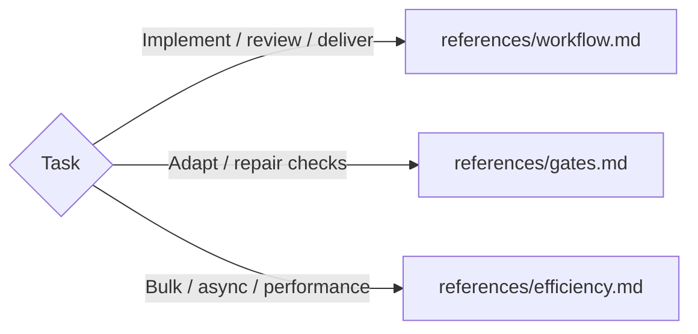

# Hard Eng

Load only matching routes.

```mermaid
flowchart LR
  T{Task} -->|Implement / review / deliver| W[references/workflow.md]
  T -->|Adapt / repair checks| G[references/gates.md]
  T -->|Bulk / async / performance| E[references/efficiency.md]
  click W "references/workflow.md"
  click G "references/gates.md"
  click E "references/efficiency.md"
```
