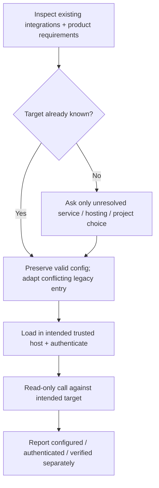

# Set up relevant integrations

Apply during first setup, brownfield adoption, scaffold updates or a relevant MCP failure. Reuse repository configuration, existing secret-loading launchers and settled product decisions. Ask only for missing choices; never ask for a secret in chat or repeat an answered hosting/project question.

- Greenfield = imports cannot reveal an unimplemented product choice. Resolve intended backend/observability from the product plan before configuring those services; no blanket installation of unrelated integrations.
- Brownfield/update = inspect existing harness entries, actual endpoint, project identity and env owner first. Valid matching setup needs no repeat interview. A legacy Hard Eng entry is not proof of suitability; migrate it within existing authorization, preserving custom settings. Unknown consequential choices remain explicit blockers.
- The piped installer has no interactive questionnaire. Unresolved optional services are reported as `MCP setup pending`; the core scaffold is installed so HE Plan can resolve only the missing choices. Supply the known endpoint/host from the existing environment, then rerun setup. Conflicting existing configuration fails before writes. Do not mark setup ready from exit status or a revision marker alone.

| Integration | Selection + proof |
| --- | --- |
| Appwrite | Follow the [canonical MCP owner](../../appwrite-backend/references/mcp-servers.md). `APPWRITE_ENDPOINT` selects Cloud OAuth (`https://mcp.appwrite.io/`) or the self-hosted repo launcher. Reuse an existing valid URL/launcher on updates. Prove the intended endpoint/project with a read-only call. |
| Sentry | Reuse the existing target. New SaaS setup: supply `SENTRY_MCP_URL`, preferably `https://mcp.sentry.dev/mcp/{org}/{project}`; preserve an existing chosen scope. Self-hosted: one executable `scripts/sentry-mcp` resolves its own repo root, loads the existing gitignored env file, validates `SENTRY_HOST` + `SENTRY_ACCESS_TOKEN`, and execs `pnpm dlx @sentry/mcp-server@latest`. Preserve existing compatible launchers/configs. Read-only organization/project access proves readiness; token scopes and unsupported tools follow [Sentry's official server](https://github.com/getsentry/sentry-mcp/tree/main/packages/mcp-core). |
| Dart/Flutter | Official SDK command `dart mcp-server`; verify native initialization and the tools needed for the operation. Existing package-command registrations require migration to the official command before claiming current setup. |
| Marionette | Optional debug-only integration. Detection looks for binding initialization, but readiness still requires a compatible running app. Initialize before other Flutter bindings, including Sentry; follow [Flutter runtime setup](../../building-flutter-apps/references/dart-mcp-e2e-testing.md). Registration alone does not configure or connect a running app. |
| Context Mode | Claude plugin or configured host MCP; verify an actual processing call when used. |
| Codebase Memory | Verify the current repository/index before relying on retrieved code. |

For Codex, project trust controls loading; hook trust is separate. Inspect `codex mcp list` inside the target root. Use `codex mcp login <name>` for an unauthenticated OAuth server. A newly written entry may require reconnecting or starting a fresh task before tools appear. State that limitation; never claim installation failed solely because the current task cannot see newly configured tools. Do not change global trust/config or create a duplicate global server.

Generated configurations target Codex, Claude Code and Copilot CLI. VS Code's `.vscode/mcp.json` uses a separate JSONC `servers` schema and is preserved; inspect its existing choices and adapt that host explicitly when required. Copilot cloud uses repository settings and does not support these OAuth connections; no generated file configures it.

Probe relevant integrations once when setting them up or relying on them, not every tool call. Unrelated service outages must not trigger a mandatory startup sweep. Keep keys and personal/project details out of public scaffold files and PRs.
