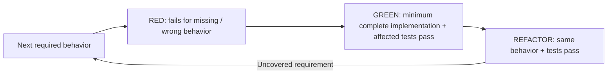

# Test design + quality

Apply when designing, changing or reviewing tests, alongside the AGENTS.md Tests rule. Reuse the existing framework, fixtures + suite; tests may follow implementation unless TDD is requested or the change fixes a bug.

| Decision | Required proof |
| --- | --- |
| Expected result | Derive from accepted behavior/public contract, independently of the implementation under test. Name precondition + action + observable result; copying the implementation's calculation into the assertion proves neither correct. |
| Level | User journey → E2E at its real entry point, written with the code. Lower-level tests only for logic with many input cases, or a bug reproduction; use the narrowest public seam crossing the behavior's real owner. Agent-written tests that restate the code add cost, not proof. |
| Boundary | Assert return/state, emitted contract, visible result or durable effect. Internal calls/structure alone do not prove behavior; behavior-preserving refactors should retain valid tests. |
| Outside services | Keep real collaborators that can expose the failure. Replace a slow, unstable, destructive or unavailable outside service with a fake at its network/process boundary; reuse the project's fake, else build one in its test harness from recorded real responses, never from the code's own assumptions. A fake can share the code's wrong assumption → run the journey once against the real service (approved test account/data) before Complete, else report it pending. Mock calls are sufficient only when those calls are themselves the required contract. |
| Cases | Cover relevant boundaries, invalid/empty inputs, denied access, failure/recovery, concurrency + state/time transitions. Use realistic minimal data; isolate mutable state and avoid timing/order-dependent assertions. No mandatory matrix of unrelated cases. |
| Regression | Write the test before the fix, with the expected result from the report or contract, not the fixed code. Show it fails on the original defective behavior for the expected reason, then passes with the fix. Use an available defective revision or existing controlled reproduction; unavailable red evidence remains a stated gap. Setup/compiler/fixture failures are not valid regression proof. |
| Runtime contract | Compiler/interpreter/runner behavior needs compatible tool execution. Source-text checks establish wiring only. UI/device/API/CLI journey proof → [E2E](../../e2e/SKILL.md). |
| Strength | Coverage, execution, snapshots, existence checks + aggregate counts alone cannot establish the intended behavior. Judge whether a realistic wrong result would fail the assertion; remove duplicate or implementation-coupled proof only within task scope. |

## Explicit TDD

Apply only when TDD/red-green-refactor is requested. One observable behavior per increment; reuse the scenario's contract + meaningful seam above.

Harness failure → repair harness before accepting RED. Changed requirements → update expected behavior before continuing; do not generalize production code merely to satisfy an artificial test.

## Completion

- Report behavior + test path + repeatable setup + commands + assertions + actual results + material gaps using existing task evidence; no separate ledger or behavior-ID scheme. State unavailable regression or E2E proof explicitly.
- Preserve useful success + failure artifacts (logs, traces, media) per [E2E](../../e2e/SKILL.md#visual-proof-and-completion). Screenshots alone do not prove correctness.
- Mutation survivors from [pre-push or the mutation command](workflow.md): for each meaningful survivor, add the missing test or explain why it is equivalent, invalid or deferred and its consequence. A score alone is insufficient.
- Run applicable project gates. This guidance supports judgment; passing checks cannot certify test quality.
