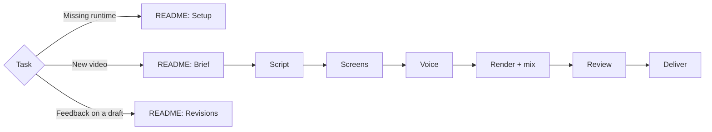

# Marketing Video

Real product screens + big bold brand type + one calm voice. Commands run from this skill's directory; the video's work folder lives outside it. Screens come from one of two routes:

- **Recordings**: [Product Walkthrough Video](../product-walkthrough-video/SKILL.md) takes or existing product videos, cut into clips.
- **Staged screenshots**: app screens rendered over made-up data, with a drawn cursor, click ripple and zoom. Use it when real data is private or no recordings exist.

## Core rules

- The agent cannot hear. Voice, pace and pronunciation are the human's call: send a short sample before generating every line, and never call audio "better" without their listen.
- Real product only: screens, logos and fonts come from the product and brand owners. Never type a brand name where its logo belongs; never invent a screen or a feature.
- Cut sign-in, invite-link, loading and empty screens. Show access behaviour only when the audience must learn it (a training video), and never a password being typed.
- Zoom only on a hand-placed box around the thing the voice names, and keep that whole box in frame. No pointer-following or automatic zoom. A staged cursor moves to a named target; it never drives the camera.
- Hard cuts between recorded clips. Quick crossfades (0.4 s) between staged screenshots or scenes are fine; no slow fades to or from black.
- Explanatory graphics copy an approved design the brand already uses (deck slide, site section). Do not invent card, chip or panel styles.
- Plain, specific words, like a colleague showing the product. No hype words, slogans or rule-of-three taglines; boldness comes from type size, layout and motion.
- Private data never appears: recordings use demo accounts, staged screens use made-up records.
- Once the human approves a part, freeze it. Change only what the latest feedback names; keep liked voice takes and regenerate only changed lines.

Completion = [README: Completion gate](README.md#completion-gate) on the exact delivered file.
