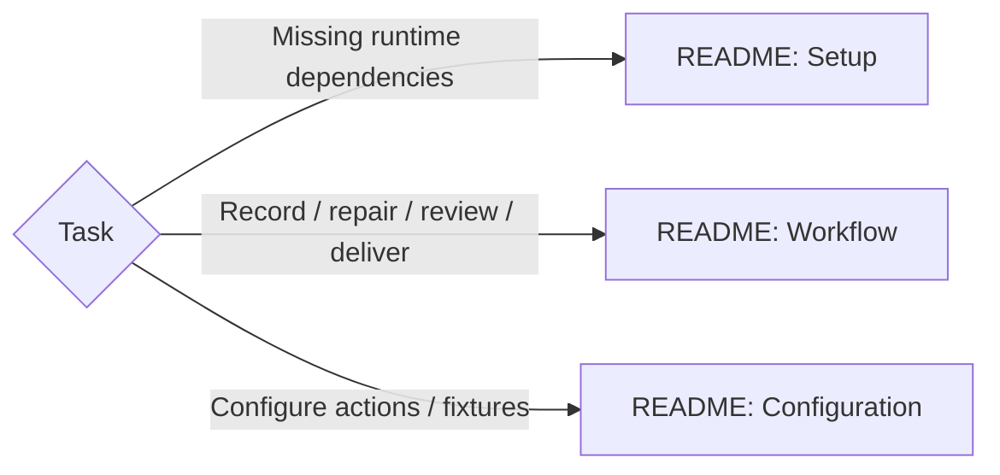

# Product Walkthrough Video

Use the bundled recorder + review/conversion scripts; no replacement recorder. Polished recording changes pointer/pacing: raw rendering or timing claims need separate evidence.

Load matching README sections; commands run from this skill's directory.

Completion = README's completion gate on the exact delivered MP4. A user-reported defect reopens the journey + enforcement that missed it.
