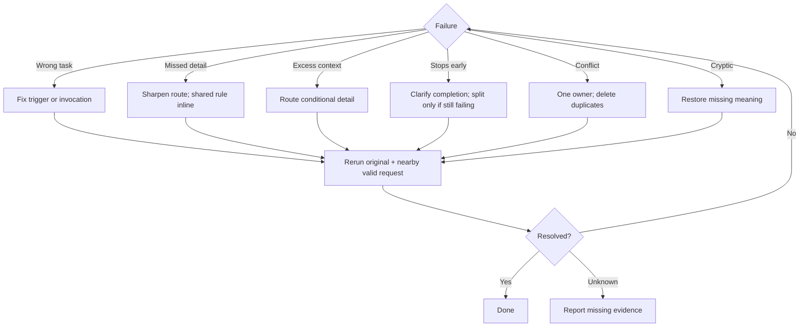

# Repair observed skill failures

Start = failing request + observed behavior + intended outcome. Fix the smallest responsible instruction; rerun the request.

Verification = original failure corrected + nearby valid behavior preserved. Unknown → name missing evidence; no new universal rule without a demonstrated need.
