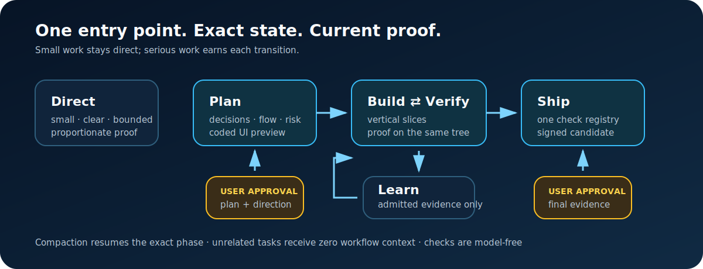

# Hard Eng for Codex

Hard Eng is one stateful OpenAI Codex workflow for work that must be understood,
built, proved, and shipped without losing its place. It keeps Plan, the
Build–Verify loop, Ship, and evidence-backed Learn under one `$hard-eng` entry
point. Small, clear work stays direct.



## Pick the smallest route

| Request | Route |
| --- | --- |
| Read-only answer, mechanical edit, or small well-understood fix | Work directly and run proportionate project checks |
| New feature, material behavior, ambiguous product/UI, risky migration, or requested lifecycle | Invoke `$hard-eng` and enter Plan |
| Clear small fix that needs tracked proof or shipping | Invoke `$hard-eng`; use Direct Build when its safety contract permits |

Hard Eng never weakens repository rules, security, accessibility, privacy, or
data-loss checks to make a request fit the direct route.

## The five-minute flow

### 1. Plan until the decisions are resolved

Ask Codex:

```text
Use $hard-eng to plan and deliver this feature: <objective>.
```

Codex discovers product, user, design, state, data, API, operations, rollout,
risk, proof, and ownership facts before asking one useful question at a time.
The only visible specification is repository-root `plan.md`. It cannot pass
with open readiness items, detached adversarial findings, missing proof, or an
unapproved plan digest.

For UI work, Plan includes a complete inspectable flow with realistic sanitized
mock data. Existing products reuse their real tokens and components. Greenfield
or radical visual work may use a small OpenAI Imagegen direction-board budget
only after explicit approval, then converts the selected direction into a coded
interactive prototype. Generated pixels never replace responsive, interaction,
accessibility, component, or token decisions. The user approves the direction
before Build.

### 2. Build and Verify in one loop

Each vertical slice cycles through:

```text
expected failure → canonical implementation → focused verification → diff review
```

Codex loads only the accepted slice excerpt, changes the real owner, and binds
failure, implementation, verification, and review proof to the same source-tree
fingerprint. A failed verification returns to the same slice. A third unchanged
hypothesis is blocked instead of burning tokens on blind retries.

User-visible work pauses at the approved review cadence with comparable
real-app screenshots and, when sequence matters, video. A defect returns to the
same Build slice; a changed product/design decision returns to Plan.

### 3. Ship the exact candidate

Ship is deterministic and model-free:

```sh
he check --all --repo .
he ship --repo . --run <run-id> --json
```

The first command runs the one repository check registry. It fails closed when
the project exposes no meaningful checks, inventories declared Node, Flutter,
Dart, Go, Python, and Rust owners, kills the whole process group on timeout,
and rejects candidate mutation. The second command also checks lifecycle
preconditions and creates a short-lived signed receipt for the exact candidate.
Untracked candidate files must be named individually with `--allow-untracked
<relative-file>`; secret-like and unknown paths are rejected.

For user-visible work, publication waits for explicit approval of the final
before/after evidence pack and candidate fingerprint. Completion additionally
requires exact commit/tree/parent currentness, CI on that commit, repository
protection evidence where applicable, and a rollback target.

Before a publish or other non-idempotent external action, Hard Eng checkpoints
the precondition fingerprint, one idempotency key, and a safe reconciliation
command. Publication preparation additionally binds the mode, target ref, live
remote, and—for direct main—the current `origin/main`, classic protection, and
effective GitHub rules. A crash blocks compaction/retry until the external
result is reconciled.

After publication, the server uses live `git ls-remote`, verifies the local
commit/tree/first parent, and replaces caller-supplied CI/protection assertions.
For GitHub it reads exact-SHA check runs; PR mode also binds the open ready PR
head and fails on unresolved review threads. Direct-main mode requires the
post-push protection/rules digest to equal the pre-push digest. It then stops
for explicit user approval and repeats the live observation. Only that exact
approved commit can become Complete.

### 4. Learn only from a proven gap

Learn is an interrupt, not a compulsory ceremony. It admits a repeated miss,
escaped defect, safety-critical gap, or clearly high-leverage workflow gap only
with typed provenance. It repairs the behavior, reproduces the bad case, and
adds the smallest durable guard in the existing owner—usually a test, schema,
scanner, CI check, or owner document. A tree-changing guard returns to focused
Build verification.

## State, compaction, and resume

State lives outside the working tree in the Git worktree family’s common
metadata. It is HMAC-bound to one repository, checkout, Codex task, run, and
revision. Unrelated tasks receive no Hard Eng context. Session start and
pre-compaction hooks restore only an already-bound run; they do not inject the
workflow into ordinary tasks.

Read state without changing it:

```sh
he runs --repo .
he status --repo . --run <run-id>
he doctor --repo .
```

After compaction, the same task resumes its exact phase, substep, and revision.
In a new task, name the run ID and ask `$hard-eng` to resume it. A different
task cannot take over silently; Codex must show the current revision and obtain
explicit user approval.

## Codebase Memory and Context Mode are required support tools

Hard Eng uses [Codebase Memory](https://github.com/DeusData/codebase-memory-mcp)
first for topology, symbols, callers, dependencies, routes, architecture, and
change impact. The CLI fallback uses the same MCP tools:

```sh
codebase-memory-mcp cli list_projects
codebase-memory-mcp cli index_repository '{"repo_path":"<absolute-repository-path>"}'
codebase-memory-mcp cli get_architecture '{"project":"<project-id>"}'
codebase-memory-mcp cli search_graph '{"project":"<project-id>","name_pattern":".*Handler.*","limit":20}'
codebase-memory-mcp cli trace_path '{"project":"<project-id>","function_name":"Handler","direction":"both","depth":3}'
codebase-memory-mcp cli detect_changes '{"project":"<project-id>"}'
```

Hard Eng uses [Context Mode](https://github.com/mksglu/context-mode) for large
logs, command output, documents, diffs, APIs, and datasets. It is evidence
storage/search, never a file editor:

```sh
context-mode doctor
context-mode index <path> --source <label> --project <absolute-repository-path>
context-mode search "<query>" --source <label> --project <absolute-repository-path> --limit 10
```

Run setup doctor to verify both tools and their CLI fallbacks. Installation,
upgrades, MCP registration, and hook trust remain explicit user actions; Hard
Eng never silently changes either tool.

For a stateful run, the server executes the requested bounded graph command
against the exact repository and replaces any caller evidence digest. A mere
`list_projects` health check cannot pass Plan or Build: it requires
`get_architecture`, `search_graph`, `trace_path`, or `detect_changes`. Ship
requires a fresh runtime-observed `detect_changes`. Context Mode pass receipts
require the source to be indexed first; the server repeats one bounded
exact-project `context-mode search` and rejects an empty/missing source. A
fallback is legal only after the server observes that search fail. Raw tool
output and query parameters never enter the checkpoint. Setup separately uses
`context-mode doctor` for installation health.

Context Mode's MCP/CLI health and its automatic hook routing are separate
facts. MCP/CLI support is required; its six global Codex plugin hooks are
optional because they affect unrelated tasks too. If you explicitly enable
them, `context-mode doctor` must report the whole suite as `PASS`, and Hard Eng
must pass the coexistence check before cutover. A manual MCP entry exposes the
tools without enabling global routing, capture, compaction, or resume hooks.

## Setup

Requirements: OpenAI Codex, Git, Node.js 22 or newer, macOS or Linux, and the
default `~/.codex` under the selected home. Setup fails closed on an unsupported
platform or custom `CODEX_HOME`; it never guesses which global owner to mutate.
From a trusted clone, inspect the machine without changing it:

```sh
node scripts/setup.mjs doctor
```

Preview a new install, copy the reported `plan_digest`, inspect every proposed
path, then authorize that exact immutable plan:

```sh
node scripts/setup.mjs install --dry-run
node scripts/setup.mjs install --confirm <plan-digest>
```

Existing managed installs use the same two-step `update` flow. After an old
trusted source checkout has been updated to this release, its global wiring
uses `migrate`; deletion of old live surfaces additionally requires the
separate `--live-cutover` flag. Setup never replaces an unknown old source
checkout in place. It refuses unknown/modified targets, binds approval to the
selected home and source digest, writes transactionally, and rolls back an
interrupted apply.

The approved transaction merges the personal marketplace without deleting
unrelated plugins, then uses the supported Codex plugin lifecycle:
`codex plugin add hard-eng@personal --json`. Update refreshes that same owner;
uninstall uses the matching remove operation. Six optional packs remain
discovered but disabled. Hook trust is deliberately manual: restart Codex, open
`/hooks`, review the current plugin hash, and trust it. Setup never edits Codex
trust storage.

If the process is killed, setup leaves a private journal and refuses another
mutation. Inspect and recover the exact interrupted generation:

```sh
node scripts/setup.mjs recover --dry-run
node scripts/setup.mjs recover --confirm <plan-digest>
```

Every successful changed setup returns a `rollback_bundle` digest and keeps
the exact previous live wiring in a private hash-verified bundle. Restore only
the current generation with a fresh dry-run and confirmation:

```sh
node scripts/setup.mjs rollback --backup <rollback-bundle-digest> --dry-run
node scripts/setup.mjs rollback --backup <rollback-bundle-digest> --confirm <plan-digest>
```

Rollback refuses modified targets, corrupt/stale bundles, and another installed
generation. It is itself transactional. Bundle directories are `0700`, receipt
and backed-up files are private, and setup output contains hashes and relative
paths—not backed-up bytes.

Migration preserves the executable body of an exact old shell PATH block while
renaming only its Hard Eng ownership markers. This keeps Codebase Memory and
Context Mode resolvable. It can remove the recognized old Playwright cache with
an exact copy preserved in the private rollback bundle, but retains any cache
containing an unknown entry.
Watchdog/cron owners, no-mistakes dependencies, and Treehouse retirement appear
as explicit blockers; they are never hidden behind a successful status.

Only the core `hard-eng` plugin is enabled by default. Flutter, Appwrite, web,
Sentry, delivery, and authoring packs are small optional plugins and require an
explicit selection in Codex. Plugin and hook trust is completed in Codex’s own
UI; setup does not forge approval.

## Cost guarantees

- One entry skill and one small MCP state tool are the default advertised surface.
- Hard Eng launches no Codex/model/subagent/Imagegen reviewer; it rejects known model, daemon, legacy, and network-installer commands. Repository-owned test code remains the repository’s explicit trust boundary, not an OS sandbox.
- Plan is loaded once; routine Build loads only the current slice excerpt.
- State is reduced to a bounded capsule instead of replaying transcripts or raw tool output.
- Canonical JSON stays private on disk or on required MCP/Hook wire protocols; the model sees the compact capsule, so switching state to TOON would not save plan tokens.
- Implement and Verify share one loop; checks run once per candidate unless a classified change or flake justifies a rerun.
- Imagegen defaults to zero calls; release model evals are opt-in and capped.
- Deterministic gates prevent weaker models from skipping state transitions, but no guardrail fabricates missing product judgment or code understanding.

## Codex worktrees and ignored local files

Tracked hidden files arrive through Git automatically. Ignored files do not.
Inspect exact required local inputs with:

```sh
he doctor --worktree --repo .
he doctor --worktree --repo . --worktree-path <exact-relative-path>
```

Codex officially accepts ignored paths or gitignore-style patterns in
[`.worktreeinclude`](https://learn.chatgpt.com/docs/environments/git-worktrees).
Hard Eng deliberately narrows that to exact repository-relative entries so a
pattern cannot silently expand into credentials or caches. Codex copies approved
entries at managed-worktree creation; Hard Eng only validates the source and
does not implement a second copier. Codex skips source symlinks and does not
overwrite an existing destination.

Broad globs, home paths, `.git`, `.codex`, dependency/build/cache folders,
symlinks, sockets, and missing or non-ignored paths fail. A safe ignored hidden
directory is allowed, but a nested secret must be named exactly. Every `.env`,
key, or credential-like path requires explicit approval before it is added.
Prefer a repository setup script for dependencies and generated non-secret
configuration.

## Troubleshooting

- `he doctor --repo .` reports invalid permissions, pending actions, and locks without repairing or deleting anything.
- `node scripts/setup.mjs doctor` reports support-tool, plugin, launcher, hook-trust, model, and advertised-context facts without exposing configuration contents.
- A plan digest or candidate drift returns to reconciliation; never edit fingerprints or state by hand.
- A pending external action must be observed and reconciled once before retrying.
- A stale lock is reported with its exact identity; removal always needs separate approval.
- If Codebase Memory fails, diagnose/index it once before bounded text search. If Context Mode fails, run `context-mode doctor` once before a bounded fallback.

## Uninstall

Preview removal, inspect the exact digest, then authorize it:

```sh
node scripts/setup.mjs uninstall --dry-run
node scripts/setup.mjs uninstall --confirm <plan-digest>
```

Uninstall removes only files owned by the install manifest and refuses modified
or unknown targets. Hard Eng run state is preserved. State deletion is a
separate destructive mode with one exact root and a fresh confirmation digest:

```sh
node scripts/setup.mjs purge-state --state-root <exact-state-root> --dry-run
node scripts/setup.mjs purge-state --state-root <exact-state-root> --confirm <plan-digest>
```

## Development

```sh
npm test
node plugins/hard-eng/runtime/he.mjs check --all
```

CI invokes the same registry. The runtime has no production npm dependencies.
Third-party inspiration and licenses are recorded in
[THIRD_PARTY_NOTICES.md](THIRD_PARTY_NOTICES.md). Hard Eng is licensed under
[MIT](LICENSE).
