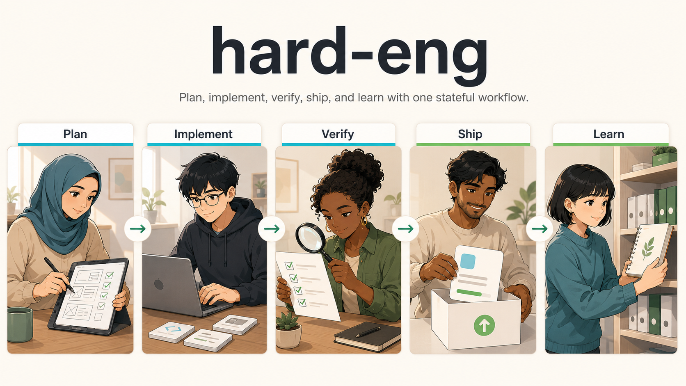
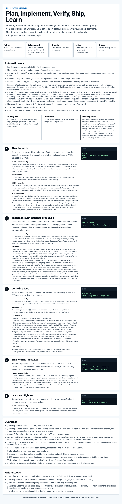

<p align="center">
  
</p>

<!-- markdown-hygiene: allow-setup-internals -->

# Hard Eng

Hard Eng makes AI coding agents plan, prove, ship, and learn for serious feature and shipping work instead of guessing, editing random files, and saying "done".

It is an opt-in local discipline layer for Codex on macOS today. It installs shared rules, skills, hooks, and MCP config into the agent homes on a machine, then routes full Hard Eng work through `/he:plan`, `/he:implement`, `/he:verify`, `/he:ship`, and `/he:learn`.

Every serious coding task goes through five gates:

1. Plan the work
2. Implement in the real owner
3. Verify with evidence
4. Ship safely
5. Learn from repeated failures

When the plan breaks, Hard Eng returns to state, names the owner, reruns the guard, and stays hard

<a id="tested-scope"></a>
> Tested scope: this repo has only been tested on Codex running on macOS. Other agent homes can be linked, but Codex on macOS is the validated path today.

<a id="maturity"></a>
> Maturity: Hard Eng is pre-1.0 and not version 1 yet. Treat `0.x` releases as alpha workflow releases: skills, installer prompts, state schema, guards, and tags can still change before `v1.0.0`.

[](#he-workflow)
[](#versioning)
[](#tested-scope)
[](#shipping-and-safety)

## 30-Second Version

Without the Hard Eng flow:

`Ship this feature` -> agent may guess, edit random places, and say done without durable proof.

With `/he:plan`:

`Ship this feature` -> agent plans, records state, finds the owner, changes the owner, verifies, ships with evidence, and learns from repeated failures.

If you just say "fix this bug", Hard Eng does not automatically run the full `/he:*` workflow. The agent follows `AGENTS.md`: read the owner, use the matching bug or stack skill, make the focused fix, and run verification sized to the change. Start `/he:plan` when you want the full token-intensive workflow for real features, risky changes, or shipping discipline.

Tiny flow:

```text
User: /he:plan ship login redirect fix
Agent: reads context, finds the owner route, records he-state.json, asks missing questions, returns a plan receipt.

User: /he:implement
Agent: uses test-quality, records red-first or mutation proof, changes the owner, records green implementation proof.

User: /he:verify
Agent: runs tests or other proof, records evidence.
```

Use Hard Eng when owner, proof, and shipping discipline matter. For tiny text edits or throwaway experiments, use the relevant agent directly and run the normal repo checks.

## When To Use It

Hard Eng is the heavy lane.

| Use the full `/he:*` flow for | Use normal `AGENTS.md` flow for |
| --- | --- |
| feature work that needs planning, proof, and shipping evidence | obvious one-file fixes |
| risky refactors or owner/abstraction changes | tiny copy changes |
| public release readiness | quick code reading or explanation |
| repeated failures that should become guardrails | throwaway experiments |
| unclear scope, owner, risk, or verification path | scoped fixes with clear owner and proof |

Normal bug fixes are still disciplined: the agent reads `AGENTS.md`, loads the matching skill when needed, changes the real owner, and runs checks sized to the change. Start `/he:plan` when you want the full stateful workflow.

## Demo And Examples


- Smooth illustrative terminal-flow GIF: [docs/media/hard-eng-terminal-flow.gif](docs/media/hard-eng-terminal-flow.gif)
- Checked illustrative state file: [docs/examples/he-state-plan-ready.example.json](docs/examples/he-state-plan-ready.example.json)

The checked-in GIF is an illustrative, sanitized walkthrough of the full `/he:plan` -> `/he:implement` -> `/he:verify` -> `/he:ship` -> `/he:learn` lifecycle, including `he-state.json` updates. It is not a real `codex` CLI recording. The JSON example is validated by `scripts/he-state.mjs`, but it is illustrative only; replace or supplement it with a sanitized real task state after a real `/he:*` run.

## Install

Download the setup script first, then run one mode. Use `--safe` first if you
are evaluating Hard Eng on a machine you do not already treat as a trusted
agent workstation.

```sh
curl -fsSLO https://raw.githubusercontent.com/sgaabdu4/hard-eng/main/scripts/setup.sh
bash setup.sh --safe
```

Running `bash setup.sh` with no mode starts an interactive wizard. It explains each workstation-level install and asks `y/n` before prerequisites, global npm tools, active MCP config, trusted Codex settings, watchdog, Treehouse, `no-mistakes`, worktree readiness, or cron. In non-interactive shells and CI, no-mode setup uses `--safe` behavior.

Use the complete workstation path when you want the local automation tools too:

```sh
bash setup.sh --full
```

Use the selected-skill install when you only want chosen shared rules, skills, configs, and local repo hooks:

```sh
curl -fsSLO https://raw.githubusercontent.com/sgaabdu4/hard-eng/main/scripts/setup.sh
bash setup.sh --skills-only
```

Existing clone:

```sh
cd "$HOME/.agents"
./scripts/setup.sh --safe
```

| Mode | Use it when | Installs |
| --- | --- | --- |
| `--safe` | You want the public-safe agent surface | repo clone/update, all Hard Eng skills, linked configs, local hooks |
| `--full` | You want the complete workstation path | prerequisites when allowed, MCP tools, all Hard Eng skills, configs, Git hooks, watchdog, [`Treehouse`](https://github.com/kunchenguid/treehouse), `no-mistakes`, worktree readiness |
| `--skills-only` | You only want selected agent skills | repo clone/update, selected linked skills/configs, local hooks |
| `--prereqs-only` | You are repairing setup dependencies | prerequisite tools only |
| `--dry-run` | You want to inspect planned writes | no writes; prints what setup/install would touch |
| `--uninstall --yes` | You want to remove what Hard Eng installed | managed links, skills, hooks, cron blocks, watchdog, managed bins, cache, shell PATH block |

`--full` links every Hard Eng skill automatically. Default interactive setup and `--skills-only` ask which local skills to link: `all`, `none`, or a comma-separated list such as `he-plan,he-implement,he-verify,he-ship`. The choice is saved in `~/.config/hard-eng/skills.json`; `HARD_ENG_SKILLS=all|none|skill-a,skill-b` overrides it for one run. Deselected Hard Eng-managed symlinks are removed, but user-owned skill folders are preserved.

External/community skills stay separate from this repo. Add them with the upstream `npx skills` workflow at global or project scope, then keep project-specific choices in that project's agent config.

`--safe` and `--skills-only` intentionally skip cron, watchdog, Treehouse, `no-mistakes`, MCP npm installs, active MCP config resolution, prerequisite repair, shell PATH changes, and worktree repair.

Preview an install without touching the machine:

```sh
bash setup.sh --safe --dry-run
./scripts/install.sh --dry-run
```

Lavish is installed as a narrow local UI-decision skill. Its CLI is invoked per UI decision session with `npx -y lavish-axi`, not as a general global workflow tool.

## Install Security

Hard Eng can be invasive in `--full` mode because it is a workstation bootstrap, not a normal app package.

Safe defaults:

- `approval_policy = "never"` and `sandbox_mode = "danger-full-access"` are not written by default
- To write those Codex trust settings, run with `HARD_ENG_TRUSTED_WORKSTATION=1`
- Non-trusted installs remove prior managed Codex trust settings, and MCP-skip installs remove prior managed MCP sections
- `--safe` and `--skills-only` do not install global npm tools, Treehouse, `no-mistakes`, cron, watchdog, shell PATH changes, or active MCP config, and remove old managed cron blocks
- `--full` preserves explicit `HARD_ENG_SKIP_*` opt-outs; set `HARD_ENG_FORCE_FULL=1` only when you intentionally want full mode to clear those skips

`--full` may automatically touch these surfaces:

| Surface | What it does | When it is installed or skipped |
| --- | --- | --- |
| `~/.zshenv` managed PATH block | Adds Homebrew, npm global, local bin, Flutter, and Pub cache paths so future shells can find installed tools | Written by `--full`; skip with `HARD_ENG_SKIP_SHELL_PATH_UPDATE=1` |
| Homebrew packages: Git, Node/npm, Dart | Provides source control, the JS runtime/package manager, and the Dart MCP/tooling path | Installs missing packages only; Homebrew itself bootstraps only with `HARD_ENG_ALLOW_HOMEBREW_BOOTSTRAP=1` |
| Python user package: `tiktoken` | Powers token-budget checks for `AGENTS.md` and related policy hygiene tests | Installed during prerequisite repair; skipped by `--safe`, `--skills-only`, or `HARD_ENG_SKIP_PREREQ_INSTALL=1` |
| Flutter SDK at `~/flutter` | Provides Flutter/Dart project analysis support for agent guardrails | Installed only when `flutter` is missing; skip with `HARD_ENG_SKIP_FLUTTER_INSTALL=1` or set `HARD_ENG_FLUTTER_HOME` |
| Global npm tools: `context-mode`, `codebase-memory-mcp`, `@openai/codex` | Provides local context memory, codebase graph/MCP lookup, and the Codex CLI package used by the workstation | Installed by `--full`; skipped by `--safe`, `--skills-only`, or `HARD_ENG_SKIP_NPM_INSTALL=1` |
| Codex files: `~/.codex/config.toml`, `~/.codex/hooks.json`, `~/.codex/AGENTS.md`, `~/.codex/skills/*` | Links shared rules and skills, enables Codex hooks/request-user-input, and registers MCP servers unless MCP config is skipped | `--safe` and `--skills-only` still link rules/skills/hooks but remove managed MCP config with `HARD_ENG_SKIP_MCP_CONFIG=1` |
| Codex trust settings: `approval_policy = "never"`, `sandbox_mode = "danger-full-access"` | Lets Codex run without approval prompts and without filesystem sandboxing | Never written by default; removed unless `HARD_ENG_TRUSTED_WORKSTATION=1` |
| Other agent homes: `~/.claude`, `~/.copilot`, `~/.pi`, `~/.pi/agent` | Points those agents at the same shared `AGENTS.md` and selected Hard Eng skills | Installed as managed symlinks; uninstall removes only links that still point into this repo |
| Repo-local Git hooks: `post-merge`, `post-rewrite`, `pre-commit`, `pre-push` | Refreshes submodules after pulls, blocks forbidden/generated/secret-like staged content, and runs push-time gates | Installed in this repo only; uninstall removes managed hook files |
| Managed Codex bins under `~/.codex/bin` | Installs `codex-health`, `codex-context-mode-health`, `codex-cleanup`, and `codex-watchdog` for local health and cleanup; `codex-update-stack` is trusted-workstation-only | Watchdog bins are skipped by `--safe`, `--skills-only`, or `HARD_ENG_SKIP_WATCHDOG=1`; managed `codex-update-stack` is removed unless `HARD_ENG_TRUSTED_WORKSTATION=1` |
| macOS LaunchAgent: `dev.hard-eng.codex-watchdog` | Runs `codex-watchdog` every 60 seconds, logs load/MCP warnings, runs cleanup, and repairs Codex stack drift after manual updates only when trusted stack repair is installed | Installed only on macOS when watchdog is enabled; process killing remains opt-in via watchdog env vars |
| Optional cron blocks | Runs repo auto-sync and, on trusted workstations, Codex stack update jobs on a schedule | Installed only with `HARD_ENG_ENABLE_CRON=1`; skipped refreshes leave existing blocks alone, while `--safe`, `--skills-only`, or `HARD_ENG_REMOVE_MANAGED_CRON=1` remove old managed blocks |
| Treehouse | Provides reusable worktree isolation for staged agent work | Installed or updated by `--full`; skipped by `--safe`, `--skills-only`, `HARD_ENG_SETUP_TREEHOUSE=0`, or `HARD_ENG_SKIP_TREEHOUSE=1` |
| `no-mistakes` | Provides the final local shipping gate and PR evidence workflow | Installed/initialized by `--full`; skipped by `--safe`, `--skills-only`, `HARD_ENG_SETUP_NO_MISTAKES=0`, or `HARD_ENG_SKIP_NO_MISTAKES=1` |

If any installer mode, managed path, automatic tool, or trust setting changes, update this README in the same change. `tests/setup-uninstall-contract.test.mjs` and `tests/agents-md-contract.test.mjs` enforce that documentation guardrail.

## Repository Guardrails

Public contributors should work from forks. Installing Hard Eng does not grant push access to this upstream repository.

`main` is protected on GitHub:

- changes merge through pull requests only
- direct pushes to `main` are blocked by branch protection
- repository write and merge permission is limited to `sgaabdu4`

Required PR checks:

| Check | What it proves |
| --- | --- |
| `hard-eng` | GitHub Actions runs `node scripts/check-hard-eng-full-repo.mjs` against the PR. |
| `no-mistakes-required` | The PR contains passed no-mistakes evidence from `sgaabdu4` for the current head before review or merge. Owner PRs can use the managed PR body block from `integrations/no-mistakes/scripts/repair-pr-evidence.mjs` when it says `No open no-mistakes findings`; outside PRs need a `sgaabdu4` PR comment or review with the current head SHA plus `No open no-mistakes findings` or `outcome: checks-passed`. |

If branch-protection rules, required check names, or no-mistakes PR evidence behavior change, update this README and the workflow contract tests in the same change.

## Versioning

Current version: `0.1.0-alpha.3` from [VERSION](VERSION). The matching Git tag is `v0.1.0-alpha.3`.

Hard Eng follows SemVer-style tags with `vMAJOR.MINOR.PATCH` and prerelease suffixes while it is pre-1.0. `0.x` releases are alpha workflow releases, so workflow commands, `he-state.json`, installer prompts, skill routing, and guardrails can still change until `v1.0.0`.

PR version bumps are automated by [.github/workflows/pr-version-bump.yml](.github/workflows/pr-version-bump.yml). For same-repo PRs, CI writes the next `0.x.x-alpha.N` value into `VERSION` and this README, using the PR number as a uniqueness floor. Fork PRs are not written to by CI.

Release tags are automated by [.github/workflows/version-tag.yml](.github/workflows/version-tag.yml). When a `VERSION` change reaches `main`, CI validates that the version is still `0.x.x-alpha.N`, then creates the missing `v<VERSION>` tag. CI does not guess or bump versions on `main`; the PR bump workflow owns that before merge.

## License and Disclaimer

Hard Eng is released under the [MIT License](LICENSE).

This project is provided as-is, without warranty. You are responsible for how you install, configure, run, modify, and ship with it. The maintainers and contributors are not liable for damages, data loss, security issues, workflow failures, broken installs, missed checks, or outcomes from agent-generated work.

## Uninstall

From the repo:

```sh
./scripts/uninstall.sh --yes
```

Preview uninstall:

```sh
./scripts/uninstall.sh --yes --dry-run
```

From a downloaded setup script:

```sh
bash setup.sh --uninstall --yes
```

Uninstall removes Hard Eng-managed links, skill symlinks, local hooks, cron blocks, watchdog LaunchAgent/plist, managed Codex bin files, `~/.cache/hard-eng`, `~/.config/hard-eng/skills.json`, and the managed shell PATH block. It does not remove shared tools such as Homebrew, Git, Node, Dart, Flutter, Treehouse, or `no-mistakes`.

## What Gets Linked

Agent instruction files are symlinks to `~/.agents/AGENTS.md`. Keep repo-specific overrides in project-level `AGENTS.md` files.

| Runtime | Linked config |
| --- | --- |
| Codex | `~/.codex/AGENTS.md`, `~/.codex/mcp-config.json`, `~/.codex/hooks.json`, `~/.codex/skills/*` |
| Claude | `~/.claude/AGENTS.md`, `~/.claude/CLAUDE.md` |
| Copilot | `~/.copilot/AGENTS.md`, `~/.copilot/skills/*` |
| Pi | `~/.pi/AGENTS.md`, `~/.pi/skills/*` |
| Pi agent | `~/.pi/agent/AGENTS.md`, `~/.pi/agent/skills/*` |

`~/.claude/CLAUDE.md` points to the shared rule file:

```md
@AGENTS.md
```

<a id="he-workflow"></a>

## Hard Eng Workflow

In Codex, type one `/he:*` command per stage. These are Codex skill triggers, not shell commands. Start each stage in a fresh thread with the prior receipt's handover prompt; the state file is the source of truth, not the old chat transcript. The full HTML flow lives at [docs/project-workflow-gates.html](docs/project-workflow-gates.html).

<p align="center">
  
</p>

`he-state.json` tracks:

- `steps[]`: every internal step and receipt
- `subStages[]`: every stage checklist item, with done/skipped status, evidence, ordered `sequence` when required, and skip reason when allowed
- `entryGate`: stages 2-5 must point to the previous stage receipt with `decision: PASS`
- `findings[]`: failures, review findings, planning concerns, learning/process findings, and the owner repair stage
- `guardrails[]`: deterministic scripts, tests, lints, scanners, hooks, evals, command status, evidence, and whether they block push
- `guardrailInventory.requiredGuardrails[]`: regex scanners, Git hooks, lint/analyze/typecheck, SSOT scanners, Fallow, React Doctor, and repeat-mistake prevention marked `required` with a `guardrails[]` entry or `not_applicable` with reason and evidence
- `guardrailInventory.touchedStacks[]`: UI/component/API/schema/JS/TS/Flutter/Dart stack evidence, including normalized paths, extensions, and plurals, used to fail closed on missing SSOT, Fallow, or duplicate/clone checks
- `approvalBoundaries[]`: real/generated credentials, native permission prompts, prod/backend writes, backend permission/schema/index changes, and cleanup approval proof
- `repeatMisses[]`: repeated user-caught issue classes that must route to `/he:learn`
- `context.product`, `context.design`, `context.tokenOwner`: `PRODUCT.md`, `DESIGN.md`, and token/design-system owner paths
- `planReadiness`: Grill Me stage map, full visible question text, alignment receipt, UI review proof, `planReadiness.uiReview.lavish`, artifact status, and explicit approval
- `agentWork[]`: parallel subagents and evals, with model, purpose, status, and evidence

Deterministic guardrails include regex scanners, Git hooks, lint/analyze/typecheck commands, SSOT scanners, Fallow, React Doctor, and repeat-mistake prevention through scripts, tests, hooks, or evals. Every touched-stack guardrail must be recorded in `guardrailInventory.requiredGuardrails[]` and, when required, in `guardrails[]` with owner, command, status, evidence, and `blocksPush`; missing, failed, unresolved, or skipped-without-reason/evidence guardrails block ready handoff. Ready Implement, Verify, and Ship handoffs require non-empty `guardrailInventory.touchedStacks[]` before any `not_applicable` SSOT or Fallow outcome is accepted; validators normalize path segments, file extensions, and plurals before classifying touched stacks. UI/component/API/schema work cannot mark `ssot-scanners` as `not_applicable` without owner or component-pattern search evidence. JS/TS duplicate checks require Fallow evidence; other stacks require stack-specific tool evidence or static-search fallback proof. TDD proof commands fail closed on no-op flags, failure masking, unsafe path/preload/config overrides, package-script passthrough bypasses, and dry-run/list-only runner modes.

Every stage ends with a compact receipt: `Stage`, `State`, `Decision`, `Owner/proof`, `Artifacts`, `Blocker`, `Next`, and a copy-paste handover prompt for a fresh session with the worktree, `he-state.json`, and next `/he:*` command. `he-state.mjs validate` must pass before any ready-yes handoff.

Hard Eng is intentionally fail-closed:

- `next.ready: true` fails while any step, sub-stage, blocking finding, push-blocking guardrail, or agent work is unresolved
- Required stage gates cannot be skipped: Plan context/owner-proof/artifact-choice/risk-route/state validation, Implement owner read/SSOT owner reuse/test-first/owner-change/guardrails, Verify tests/guardrails, Ship git status/hook readiness/quality gates/no-mistakes/PR review threads, Learn durable-owner/proof
- Later stages require `entryGate.decision = PASS` from the prior stage, so a fresh thread can resume from state without trusting the old transcript
- Plan requires passed context and state-validation guardrails; Implement requires ordered `sequence` proof that `test-first` and `test-first-proof` precede `owner-change`; `ssot-owner-reuse` must also precede `test-first` and `owner-change` with explicit owner-reuse evidence, then a passed `find-deterministic-owner.mjs --json` guardrail and green `implementation-proof`; Verify requires the quality gate; Ship requires ordered `sequence` proof that `no-mistakes axi run --intent ...` precedes current-head PR evidence repair, then `--check-review-threads`, then CI evidence
- `loop-complete` fails while open learning/process findings still route to `/he:learn`
- Plan readiness requires `unlimited_until_aligned`, no open questions or unknowns, user-confirmed no-guesswork alignment, and no parked artifacts
- Subagents recorded in state must use `gpt-5.5`; evals must use `gpt-5.4-mini`

| Stage | Command | What it does | Invokes automatically | Exit |
| --- | --- | --- | --- | --- |
| 1. Plan | `/he:plan` | Decides scope, owner, blast radius, proof path, risk route, product/design context, sub-stage readiness, and `PASS`/`CONCERNS`/`FAIL` | Treehouse/worktree readiness; `check-project-context-gates.mjs --require-all`; `/impeccable init` when PRODUCT.md is missing; `/impeccable document` when DESIGN.md is missing; `grill-me` for unclear outcome, scope, proof, risk, UI flow, or visual direction; Impeccable Live on the real app route with current tokens/components first; current-design-system mock only when the real surface cannot exist yet; Lavish only for UI option comparison and decisions through `npx -y lavish-axi poll`; `to-prd` or `to-issues` only when that artifact is needed | `Next: ready for /he:implement: yes/no` |
| 2. Implement | `/he:implement` | Requires prior Plan `PASS`, proves SSOT owner reuse and TDD before owner change, records green implementation proof, and wires deterministic guardrails | `test-quality`; `find-deterministic-owner.mjs --json`; `codebase-design` when ownership is unclear; existing scripts/tests/hooks before fresh reasoning; touched-area skills; SSOT scanners for duplicate-prone values, UI/component patterns, or policy concepts; Fallow clone/duplicate evidence for JS/TS | `Next: ready for /he:verify: yes/no` |
| 3. Verify | `/he:verify` | Requires prior Implement `PASS`, then runs the proof loop until every required test, review, guardrail, and E2E check is clean or explicitly blocked | `test-quality`, security/perf when touched, thermo review, E2E last, and subagents for independent proof | `Next: ready for /he:ship: yes/no` |
| 4. Ship | `/he:ship` | Requires prior Verify `PASS`, then runs status/secrets checks, hook readiness, quality gates, `no-mistakes`, PR evidence repair, review-thread closure, and CI follow-through | `git status --short`, `ensure-worktree-ready.sh --check --require-pre-push`, `check-project-quality-gates.mjs --require-push-gate`, `no-mistakes axi run --intent ...`, `repair-pr-evidence.mjs --check-review-threads` | `Next: ready for /he:learn: yes` or `Next: loop complete: yes` |
| 5. Learn | `/he:learn` | Requires an open learning/process finding, then adds a durable guard and proves it | `repeated-failure-learning`; `skill-creator` only when a skill/stage contract is the owner | `Next: loop complete: yes/no` |

Grill Me stays inside Plan. It owns `session_state.md`, its stage map, and the one-question loop. It asks as many one-by-one questions as needed until the user and AI are aligned with no guesswork. UI uncertainty goes through product, UI flow, visual design, prototype tech, prototype, backend tech, and vertical-slice stages as needed. If UI flow or visual design runs, Plan cannot pass until the real app route has been reviewed through Impeccable Live using the current design system and shared components, or a current-design-system mock is explicitly recorded as fallback because the real surface cannot exist yet.

Impeccable Live and Lavish are separate UI surfaces. Impeccable Live is visual review and variant work; Lavish is only UI decision capture through `npx -y lavish-axi poll`. A direct Impeccable page is visual evidence, not a Lavish receipt. Lavish then presents multiple UI options, returns the user's decision, saves selected choices/components, records requested tweaks, and waits for user approval. Parked questions, artifacts, UI decisions, unknowns, `CONCERNS`, or `FAIL` mean `Next: ready for /he:implement: no`.

Plan also gates context docs. Missing PRODUCT.md routes to `/impeccable init`; missing DESIGN.md routes to `/impeccable document`. Product behavior changes update `PRODUCT.md`; design, UI, component, or token changes update `DESIGN.md` and the token owner. `he-state.json` records those paths before `/he:implement` is ready.

Verify is the main fix loop. If any proof fails, `/he:verify` records a finding, routes code changes back through `/he:implement`, then reruns only the affected proof. `/he:verify` and E2E do not start while UI SSOT compliance is unresolved or disputed. `/he:ship` starts only after the verify loop is clean and work is committed.

React/Next guardrails include React Doctor, Fallow audit/dupes, lint, and typecheck. Flutter guardrails include package-root `dart analyze` with `flutter_skill_lints` and tests when present. E2E gets one retry or fallback for a repeated blocker, then asks the user; prod/backend writes, native prompts, real/generated credentials, and cleanup require recorded approval boundaries from either `e2ePolicy.requiredApprovalBoundaries[]` or risky guardrail evidence itself. Repeated miss issue classes are normalized before `/he:learn` grouping. Missing repeatable checks become scripts, tests, hooks, or evals.

SSOT guardrails are also deterministic. They keep duplicated commands, scanner owners, colors, and policy concepts tied to source files, then wire those checks into pre-commit and pre-push.

## Specialist Routing

| Need | Use |
| --- | --- |
| Choose the next workflow, skill, or stage | `workflow-help` |
| Clarify ambiguous work before building | `grill-me` |
| Diagnose hard bugs, flakes, regressions | `diagnosing-bugs` |
| Decide module ownership or abstraction shape | `codebase-design` |
| Turn resolved context into a spec | `to-prd` |
| Split a plan into vertical-slice issues when slices are missing or should be published as work items | `to-issues` |
| Design or repair tests | `test-quality` |
| UI systems, tokens, product polish, or UI option decisions | `atomic-ui` + `impeccable`; use Lavish only to compare UI options and record decisions |
| React app or Next.js implementation/review | `react-doctor` + `fallow`; include `fallow dupes` / clone-group checks for duplication; use `vercel-react-best-practices` for performance/composition |
| Flutter/Dart app work | `building-flutter-apps` |
| Appwrite backend work | `appwrite-backend` |
| Sentry, observability, issues, or setup | `sentry-workflow` as the front door, with setup or CLI subskills routed behind it |
| User-like UI regression proof | `e2e` |
| Latency or efficiency work | `performance-rescue` |
| Security, auth, secrets, or data exposure | `security-review` |
| Strict maintainability review | `thermo-nuclear-code-quality-review` |
| Direct no-mistakes validation details | `no-mistakes` |

## Inspiration And Upstreams

Hard Eng borrows ideas from good public agent-workflow projects, but keeps this
repo's state, hooks, and local rules as the source of truth.

| Project | GitHub | What Hard Eng takes |
| --- | --- | --- |
| Compound Engineering | [`EveryInc/compound-engineering-plugin`](https://github.com/EveryInc/compound-engineering-plugin) | Plan/review/execute loop shape, subagent-friendly stages, and compounding workflow mindset. |
| BMAD Method | [`bmad-code-org/BMAD-METHOD`](https://github.com/bmad-code-org/BMAD-METHOD) | Structured planning, role separation, and readiness before build. |
| Matt Pocock skills | [`mattpocock/skills`](https://github.com/mattpocock/skills) | Grill Me-style human alignment and senior-engineer taste; Hard Eng makes it stateful with stage receipts, context gates, and loop enforcement. |
| DESIGN.md | [`google-labs-code/design.md`](https://github.com/google-labs-code/design.md) | Persistent product/design context and token-owned design memory. |
| Treehouse | [`kunchenguid/treehouse`](https://github.com/kunchenguid/treehouse) | Isolated reusable worktrees before feature planning/coding. |
| Lavish | [`kunchenguid/lavish-axi`](https://github.com/kunchenguid/lavish-axi) | Browser-based UI option comparison, polling, and saved decision receipts only. |
| no-mistakes | [`kunchenguid/no-mistakes`](https://github.com/kunchenguid/no-mistakes) | Final safety gate, PR evidence, and push discipline. |
| Impeccable | [`pbakaus/impeccable`](https://github.com/pbakaus/impeccable) | PRODUCT/DESIGN context loading and token-first UI review. |
| React Doctor | [`millionco/react-doctor`](https://github.com/millionco/react-doctor) | React/Next diagnostics before ship. |
| Fallow skills | [`fallow-rs/fallow-skills`](https://github.com/fallow-rs/fallow-skills) | JS/TS code-health, duplicate, and risk checks. |
| Vercel agent skills | [`vercel-labs/agent-skills`](https://github.com/vercel-labs/agent-skills) | React/Next performance and composition guidance. |
| Anthropic skills | [`anthropics/skills`](https://github.com/anthropics/skills) | Skill packaging and reusable agent capability patterns. |
| Tavily skills | [`tavily-ai/skills`](https://github.com/tavily-ai/skills) | Web research and URL extraction workflow patterns. |
| Sentry AI skills | [`getsentry/sentry-for-ai`](https://github.com/getsentry/sentry-for-ai) | Sentry-first issue routing and observability workflows. |
| Sentry CLI | [`getsentry/cli`](https://github.com/getsentry/cli) | CLI-backed Sentry inspection. |
| OpenAI skill evals | [Testing Agent Skills Systematically with Evals](https://developers.openai.com/blog/eval-skills) | Deterministic checks plus `gpt-5.4-mini` model evals for skill routing and regressions. |

Hard Eng keeps the useful pieces and leaves the ceremony:

- Keep: help/front-door routing, readiness checks, next-action clarity, sharper vertical slices, and visible loop structure
- Skip: personas, menu codes, generated story state, and planning ceremony that slows implementation
- Local delivery stays stricter: code evidence, state receipts, owner-first implementation, deterministic guardrails, E2E proof, thermo review, and `no-mistakes`

## Repo Layout

| Path | Role |
| --- | --- |
| `AGENTS.md` | Global rules: tool routing, blast-radius checks, verification gates, writing style, and skill budgets. |
| `skills/` | The active skill surface. Local skills are real folders; upstream skills are symlinks. |
| `vendor/skill-upstreams/` | Pinned upstream skill sources used by setup and local skill links; Hard Eng-specific changes belong in local wrappers, integrations, route maps, hooks, or evals. |
| `hooks/` | Safety hooks for command blocking, secret protection, and Codex session behavior. |
| `codex/hooks.json` | Codex hook wiring. |
| `codex/bin/` | Token-free Codex watchdog and health scripts installed under `~/.codex/bin`. |
| `mcp-config.json` | Shared MCP defaults for `context-mode` and `codebase-memory-mcp`. |
| `agents/` | Subagent role prompts. |
| `scripts/` | Install, uninstall, cron, guardrails, and checks. |
| `tests/` | Contract checks for symlinks, hooks, env behavior, README links, workflow state, and repo policy. |

## Setup Switches

Setup switches are shell environment variables. For one run, put them before the command:

```sh
HARD_ENG_TRUSTED_WORKSTATION=1 bash setup.sh --full
HARD_ENG_SKIP_FLUTTER_INSTALL=1 HARD_ENG_SKIP_SHELL_PATH_UPDATE=1 bash setup.sh --full
```

For several commands in the same shell, export them first:

```sh
export HARD_ENG_SKIP_NPM_INSTALL=1
export HARD_ENG_SKIP_MCP_CONFIG=1
bash setup.sh --full
```

Unset a variable to return to the installer default:

```sh
unset HARD_ENG_SKIP_NPM_INSTALL HARD_ENG_SKIP_MCP_CONFIG
```

| Variable | Effect |
| --- | --- |
| `HARD_ENG_ENABLE_CRON=1` | Install the optional auto-sync cron during setup. |
| `HARD_ENG_SKIP_CRON=1` | Skip optional cron installation. |
| `HARD_ENG_REMOVE_MANAGED_CRON=1` | Remove only the marked Hard Eng cron blocks when cron is skipped. |
| `HARD_ENG_DRY_RUN=1` | Print planned setup/install writes without changing files. |
| `HARD_ENG_FORCE_FULL=1` | With `--full`, clear explicit `HARD_ENG_SKIP_*` opt-outs and use the complete workstation setup defaults. |
| `HARD_ENG_TRUSTED_WORKSTATION=1` | Allow installer to write Codex `approval_policy = "never"` and `sandbox_mode = "danger-full-access"`. |
| `HARD_ENG_INSTALL_AGENT_SURFACE=0` | Answer no to the no-mode wizard's public-safe agent surface question. |
| `HARD_ENG_SETUP_PREREQS=1` | Answer yes to the no-mode wizard's prerequisite repair question. |
| `HARD_ENG_SKIP_PREREQ_INSTALL=1` | Skip prerequisite repair. |
| `HARD_ENG_ALLOW_HOMEBREW_BOOTSTRAP=1` | Allow setup to run the upstream Homebrew bootstrap when Homebrew is missing. |
| `HARD_ENG_SKIP_FLUTTER_INSTALL=1` | Skip Flutter SDK installation. |
| `HARD_ENG_FLUTTER_HOME=/path/to/flutter` | Install or detect Flutter at a custom path. |
| `HARD_ENG_SKIP_SHELL_PATH_UPDATE=1` | Leave the managed `~/.zshenv` PATH block unchanged. |
| `HARD_ENG_SETUP_NPM_TOOLS=1` | Answer yes to the no-mode wizard's global npm tools question. |
| `HARD_ENG_SETUP_MCP_CONFIG=1` | Answer yes to the no-mode wizard's active Codex MCP config question. |
| `HARD_ENG_SETUP_WATCHDOG=1` | Answer yes to the no-mode wizard's Codex watchdog and managed bins question. |
| `HARD_ENG_SKIP_WATCHDOG=1` | Skip or remove the managed Codex watchdog, LaunchAgent, and managed bins. |
| `HARD_ENG_SETUP_TREEHOUSE=0` | Answer no to the setup-time Treehouse question. |
| `HARD_ENG_SKIP_TREEHOUSE=1` | Skip installing or updating Treehouse during setup. |
| `HARD_ENG_SETUP_NO_MISTAKES=0` | Answer no to the setup-time `no-mistakes` question. |
| `HARD_ENG_SKILLS=all\|none\|he-plan,he-verify` | Override the saved local Hard Eng skill selection for one install. |
| `HARD_ENG_SKILL_CONFIG=/path/to/skills.json` | Store the selected local Hard Eng skills somewhere other than `~/.config/hard-eng/skills.json`. |
| `HARD_ENG_SKIP_NPM_INSTALL=1` | Skip MCP tool installation. |
| `HARD_ENG_SKIP_MCP_CONFIG=1` | Skip active Codex MCP config, remove managed MCP sections, and skip `codebase-memory-mcp` command resolution. |
| `HARD_ENG_SKIP_NO_MISTAKES=1` | Skip installing and initializing `no-mistakes`. |
| `HARD_ENG_SKIP_NO_MISTAKES_INIT=1` | Install `no-mistakes` but skip repo initialization. |
| `HARD_ENG_NO_MISTAKES_REPOS=/repo/a:/repo/b` | Initialize extra repos for `git push no-mistakes`. |
| `HARD_ENG_SETUP_WORKTREE_READY=1` | Answer yes to the no-mode wizard's worktree readiness question. |
| `HARD_ENG_SKIP_WORKTREE_READY=1` | Skip shared worktree readiness checks during setup. |
| `HARD_ENG_WORKTREE_READY_INSTALL=1` | Allow readiness repair to run `npm ci` when a hook manager needs it. |
| `HARD_ENG_SKIP_CODEX_STACK_CRON=1` | Skip the trusted-workstation Codex stack cron block. |
| `HARD_ENG_CODEX_STACK_CRON_SCHEDULE="17 5 * * 1"` | Override the trusted-workstation Codex stack cron schedule. |

## Optional Cron Sync

Enable local auto-sync:

```sh
HARD_ENG_ENABLE_CRON=1 ./scripts/install.sh
```

Set a custom schedule:

```sh
HARD_ENG_CRON_SCHEDULE="*/30 * * * *" ./scripts/install-cron.sh
```

Cron runs `scripts/auto-sync.sh`. It updates Treehouse and `no-mistakes`, pulls `main`, refreshes pinned upstream skill sources, and scans changed install surfaces for local paths and secret-shaped values. If pinned sources changed, it stages them and stops unless `HARD_ENG_AUTO_PUSH=1` is set.

Codex stack cron is trusted-workstation-only; add `HARD_ENG_TRUSTED_WORKSTATION=1` when installing cron if you want scheduled `codex-update-stack` repair. Set `HARD_ENG_SKIP_CODEX_STACK_CRON=1` to keep only auto-sync, or `HARD_ENG_CODEX_STACK_CRON_SCHEDULE` to change the stack repair schedule.

## Shipping And Safety

Default shipping path: use `he-ship`, which runs [`no-mistakes`](https://github.com/kunchenguid/no-mistakes) after local verification is clean, work is committed, and a repo has been initialized with `no-mistakes init`. Before trusting a push dry-run, `scripts/ensure-worktree-ready.sh` checks that the repo hooks are portable and active.

When working inside this repo, run:

```sh
node scripts/check-hard-eng-full-repo.mjs
```

This local gate runs the deterministic repo checks and writes full logs under `.codebase/hard-eng-full-repo/`. It includes vendor skill integrity checks and skips real E2E dogfood, model evals, and long session evals unless requested.

Eval hygiene follows OpenAI's skill-eval pattern, but model evals are not a per-session tax. Deterministic state, hook, scanner, and schema checks run by default. Use `--include-evals` only for skill/routing contract changes, release readiness, or a real regression. It runs model-backed routing, near-miss, and Grill Me stage-selection suites on `gpt-5.4-mini`. Use `--include-session-evals` only when Grill Me conversation behavior changed or needs release proof.

Local-path and secret hygiene is enforced through installed hooks and the repo gate.

## Ethos

Inspired by David Goggins' Stay Hard mindset: when the plan gets wrecked, there is one useful move left. Face the proof, fix the owner, rerun the guard, and keep going until the repo is harder to break than it was yesterday

[Watch the short operating reminder](https://www.tiktok.com/@ambition.culture/video/7269802601581989121)
