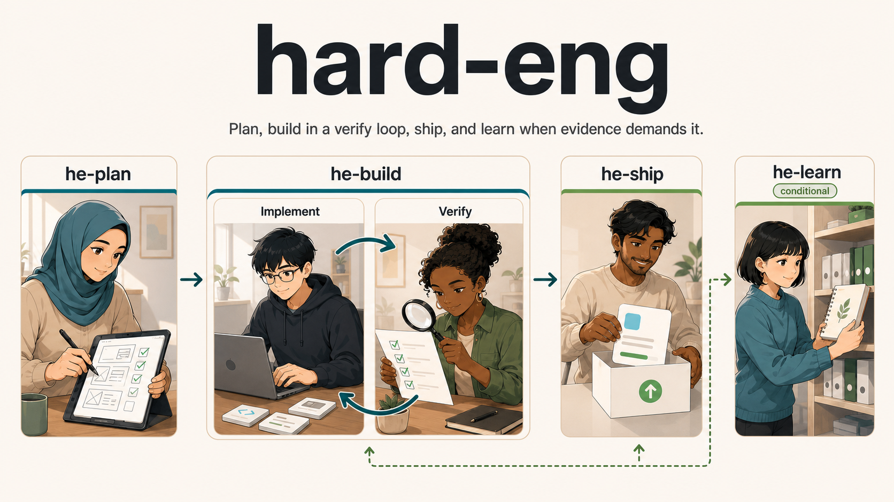

# hard-eng

> **Alpha:** Hard Eng is being rebuilt from scratch. The workflow below is the product direction while each command is rebuilt.

Hard Eng has one entrypoint:

- `$he plan <feature>`
- `$he resume`
- `$he status`
- `$he build`
- `$he ship`
- `$he learn`

`$he → he-plan → he-build (Implement ⇄ Verify) → he-ship → he-learn`

`$he` discovers the active `PLAN.md`, validates its repository state, and routes the next stage. `he-plan` uses `research` to establish current state, then `question-me` for decisions evidence cannot answer. Specialists never own lifecycle state. Context7 is CLI-only and limited to current library documentation.

Every repository must have one root `PRODUCT.md` and `DESIGN.md`. Hard Eng checks both before planning advances. If either is missing or invalid, it researches the repository, asks you only for intent the evidence cannot establish, creates the files with your approval, and validates them. Repositories without a visual surface still use `DESIGN.md` to record that boundary and its revisit trigger.

Before changing code, Hard Eng requires an isolated worktree. It records the branch, base revision, dirty state, and local setup needs; has Codex copy required ignored inputs through the repository's `.worktreeinclude`; rebuilds dependencies or generated state through the project setup owner; and runs a smoke check before feature work. Codex-managed detached worktrees are valid while working, but committing or pushing requires a named task branch.

Use `$he plan <feature>` for a new feature or intentional product-behavior change. Planning moves through repository evidence, feature outcomes, flows, UX, contracts, technical design, testing, rollout, delivery slices, consistency, and final approval. Each stage asks only decisions that evidence cannot settle; it does not advance until you approve the result or explicitly approve a justified skip.

Existing bugs and production incidents stay direct: for example, `fix all Sentry issues` starts with the Sentry workflow, not a new Hard Eng plan. If investigation uncovers a genuinely new product decision, the work escalates to `$he plan` at that point.
