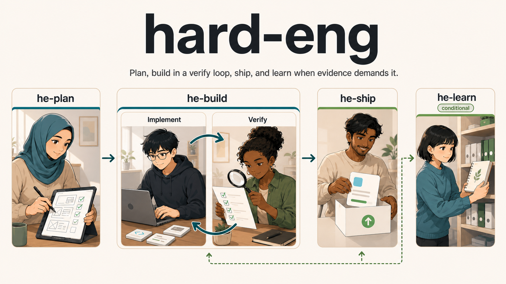

<p align="center">
  
</p>

<p align="center">
  <strong>Fast, evidence-backed engineering for OpenAI Codex and Claude Code.</strong><br>
  Align once. Build in verified vertical slices. Put extra scrutiny only where the risk is.
</p>

<p align="center">
  <a href="#what-you-get">What you get</a> ·
  <a href="#skills">Skills</a> ·
  <a href="#start-here">Start here</a> ·
  <a href="#route-matrix">Routes</a> ·
  <a href="#the-fast-feature-loop">Feature Loop</a> ·
  <a href="#repository-context">Repository context</a> ·
  <a href="#install">Install</a>
</p>

> [!IMPORTANT]
> **Alpha:** Hard Eng is evolving quickly. Its contract is stable on the essentials: explicit intent, root-cause fixes, deterministic proof, and protected approval boundaries.

## What you get

One canonical repository, wired natively into both agents. No copied files, no plugin packaging, nothing to keep in sync.

| Piece | What it is |
| --- | --- |
| `AGENTS.md` | One behavior contract, loaded by Codex and Claude Code in every session |
| `skills/` | 26 focused skills covering lifecycle, evidence, review, writing, and stack guidance — see [Skills](#skills) |
| Deterministic gates | One manifest owns commit, push, and CI checks; independent checks run together and commit checks only staged files |
| Native wiring | A `~/.codex/AGENTS.md` symlink and `~/.claude/CLAUDE.md` import stub; Codex, Claude Code, and Copilot CLI read skills from `~/.agents/skills`, while Copilot CLI reads the canonical `~/.agents/AGENTS.md` globally and uses the pinned Context Mode plugin when `~/.copilot` exists |

## Skills

Each skill is a small, focused contract the agent loads only when relevant.

**Lifecycle**

| Skill | What it does |
| --- | --- |
| `he` | Routes complex or high-risk work through one living Feature Brief |
| `he-plan` | Aligns the brief and gets a single Ready-to-build approval |
| `he-build` | Builds each approved slice in an Implement ⇄ Verify loop until green |
| `he-ship` | Delivers the exact green artifact through publish gates and required CI |
| `he-learn` | Turns proven process failures into narrow, durable prevention |

**Evidence**

| Skill | What it does |
| --- | --- |
| `question-me` | Batches independent, evidence-backed decisions by dependency frontier |
| `research` | Verifies current vendor, API, and library facts from primary sources |
| `diagnosing-bugs` | Reproduces failures and finds the root cause before any fix |
| `diagnose-flutter-mobile-runtime` | Diagnoses cross-layer failures that appear only on real Android or iOS devices |
| `repeated-failure-learning` | Proves whether repeated failures share one root cause |
| `e2e` | Proves real browser/device behavior with screenshots and recordings |
| `sentry` | Investigates and remediates Sentry issues through the installed CLI |
| `sentry-fix-loop` | Fixes, ships, and closes Sentry issues |

**Review and design**

| Skill | What it does |
| --- | --- |
| `code-review` | Reviews branch, PR, commit, or WIP diffs against standards and intent |
| `security-review` | Screens changes for auth, data, secret, dependency, and injection risks |
| `test-quality` | Designs and reviews behavior tests, QA coverage, TDD, and mutation strength |
| `codebase-design` | Shapes module boundaries, public APIs, ownership, and test seams |
| `atomic-ui` | Owns design tokens, theming, layout, and reusable UI structure |
| `writing-artifacts` | Drafts articles, issues, pull requests, and docs |
| `writing-great-skills` | Authors and reviews the skills themselves |

**Operations and continuity**

| Skill | What it does |
| --- | --- |
| `deterministic-checks` | Runs project gates before non-trivial mutations, commits, and pushes |
| `handoff` | Writes or resumes a terse, complete session handoff; only you can invoke it |
| `product-walkthrough-video` | Captures bounded product walkthroughs with verified media and truthful containment evidence |

**Managed stack guides** — vendor-pinned copies, updated only through the lock:

| Skill | What it does |
| --- | --- |
| `appwrite-backend` | Appwrite SDK work with a safety route for every CLI command |
| `building-flutter-apps` | Flutter app architecture with Riverpod |
| `vercel-react-best-practices` | React/Next.js performance patterns from Vercel Engineering |

## Start here

Most work needs no command. Give the agent a clear outcome and it chooses the lightest safe route. Skills activate on their own: Codex resolves `$skill-name` mentions and matches skill descriptions; Claude Code triggers skills from their descriptions automatically.

```text
he plan <feature>  Create a lean Feature Brief and reach Ready-to-build
he resume          Continue from the accepted brief or next slice
he status          Read progress without changing state
he build           Implement and verify the approved slices
he ship            Deliver the exact green artifact
he learn           Process an evidence-backed workflow improvement
```

## Route matrix

| Route | Use it when | What happens |
| --- | --- | --- |
| Direct | The outcome is bounded and clear | Inspect, edit the canonical owner, run focused gates, report |
| Feature Loop | A new or changed capability needs product alignment | One lean Feature Brief, one Ready-to-build approval, then verified vertical slices |
| Diagnose-first | A bug, flake, failure, or regression exists | Reproduce, find root cause and blast radius, then fix and prove |
| Critical overlay | A slice touches payment, auth, security, privacy, destructive data, irreversible behavior, or material uncertainty | Strengthen the contract, evidence, and independent review for that slice only |

Calling work a “feature,” touching many files, or finding an old context document does not automatically add process. Direct is the default. The Feature Loop exists when an observable capability needs alignment; the Critical overlay follows risk instead of making an entire project heavy.

## The Fast Feature Loop

### 1. Align once

Hard Eng reads the repository, researches current external facts when needed, and creates one lean, living Feature Brief:

- **Outcome**
- **Non-goals**
- **Material decisions**
- **Acceptance examples**
- **Affected canonical areas**
- **Risk and rollback**
- **First vertical slice**

Independent questions in one dependency frontier are asked together; choices whose options depend on an earlier answer wait for the next frontier. Once the brief contains no unresolved material choice, standard mode shows one short Ready-to-build code and accepts only the exact `APPROVE <code>` response. An explicit autonomous request approves the completed brief without another question and continues through shipping. Research is recorded in `research.json`; local-only work still records which repository evidence settled the decision.

Planning needs a readable selected checkout, not a build-ready toolchain. Setup repair, dependency smoke checks, and full gates wait until the brief is approved, so repository maintenance cannot delay alignment with the requested outcome.

There is no arbitrary limit on material questions. Before each dependency frontier, the agent researches the available evidence, answers discoverable facts itself, and batches every independent desired-state decision. Answers determine the next frontier; already-settled answers and prewritten downstream questionnaires are not repeated.

Three things happen instead of a bad question. A choice the agent can see coming but cannot yet phrase precisely is written down and raised later, once an earlier answer sharpens it. A choice that waits on something only you can do—an account, access, a credential, a file—comes back as a short checklist rather than a question you have no way to answer yet. And anything ruled outside the agreed outcome is recorded once, with the reason, and never raised again unless that outcome changes.

None of this stops the work. Both kinds of note live in the brief, so a later session picks them up instead of rediscovering them, and while something waits on you the agent carries on with every part that does not depend on it.

Standard mode still takes one reply after the complete brief. A decision answer is not called an approval. Autonomous mode must be explicitly requested in the current prompt and never carries into another task. Reads, edits, complex shell commands, subagents, recoverable live changes, payments, account or permission changes, commit, push, PR, merge, CI, and deploy or release actions continue once their intent and target are known. Hard Eng stops only for permanent data, file, or schema deletion, loss of uncommitted work, forced remote history loss, or secret exposure.

If you approve one of those stopped actions, Hard Eng records the exact tool input, allows that action once, and removes the approval before it runs. Any changed input or repeat stops again.

The brief has six plain states: `planning`, `build-ready`, `building`, `green`, `shipped`, and `cancelled`.

### 2. Build in working slices

Each slice delivers observable behavior through an Implement ⇄ Verify loop. Tests and deterministic checks run near the change, so feedback comes from working code early instead of from a large speculative plan.

At build entry, a failed setup or write check gets only the smallest safety repair and focused proof needed to unlock the checkout. The agent then implements the complete behavior before independent tooling delivery, screenshots or receipt polish, and full gates.

Discovering another caller, file, owner, schema, route, test, or configuration is normal engineering evidence. The agent updates the implementation and affected proof without reopening the brief. Replanning happens only when evidence changes the accepted outcome or the material risk contract.

### 3. Review what actually changed

Review is anchored to the actual diff, affected behavior, blast radius, and risk-targeted evidence. Standard work gets focused owner review. A critical slice adds the relevant specialist and independent review when its risk requires it, while unrelated safe slices retain the standard flow.

Findings return to Implement ⇄ Verify. An implementation defect is fixed and re-proved; a genuine outcome or risk-contract discovery reopens only the smallest affected part of the brief.

### 4. Ship the proven artifact

Shipping verifies the working product artifact before delivery and verifies that committed `HEAD` still matches it after hooks, then runs publish gates and crosses only the Git or deployment boundary the user explicitly requested. That exact request covers the unchanged delivery and normal non-deploying hooks or CI, so the agent does not ask at each step. Lifecycle screenshots, recordings, and UX references stay local and are shown to the user; they are committed only when explicitly accepted as product assets.

Reading and reversible local or external work run automatically. This includes local files, API and connector reads, logs, browser inspection, edits, tests, builds, complex shell commands, subagents, live updates, payments, account changes, deployments, publishing, pushes, and merges. Routine configured API read cost does not turn a read into an approval request. Sign-in or native permission is a user action, not an approval request. Approval is reserved for irreversible destructive loss: permanent deletion, loss of uncommitted work, forced remote history loss, or secret exposure.

For a small direct change, the agent records one tiny private receipt with the current task, intended paths, and research basis. It never blocks normal tool access. The repository checkpoint uses it to report route drift before delivery.

### Enforcement boundary

The shared pre-tool hook checks only actions that can cause irreversible destructive loss. It protects permanent deletion, uncommitted-work loss, forced remote history loss, secret exposure, and raw lifecycle-control files. Unknown tools, unknown repository paths, stale task receipts, and recoverable external actions continue. Supported adapters are the installed Codex, Claude Code, and Copilot hook payloads used by setup.

Shell and external tools are allowed by default. Indirection, substitutions, unregistered wrappers, pipelines, unknown tools, browser actions, and recoverable live writes do not need a receipt. The hook looks for known permanent deletion, uncommitted-work loss, forced remote history loss, and common secret keys or value shapes. Those checks remain pattern-based. The hook is not an operating-system sandbox and cannot prove what an allowed executable or remote service does after launch. Process deadlines, descendant cleanup, repository gates, and provider permissions remain separate controls.

## The question contract

The agent asks only when the answer materially changes:

- product outcome or user-visible behavior;
- UX choice;
- policy or default;
- security or privacy;
- data-loss exposure;
- an irreversible decision;
- one-off/local versus repository/deployed delivery when that changes the observable operation, durable ownership, or risk.

Reversible engineering details belong to the agent. It chooses from repository evidence, keeps the design simple, and verifies the result. A new file or test is not a reason to ask permission again.

If a correction changes the accepted outcome or risk contract, the agent shows the exact delta and asks for confirmation. Clear bounded corrections continue immediately.

## Quality safeguards

Speed comes from removing duplicated ceremony, not from weakening engineering:

- KISS, YAGNI, DRY, and one source of truth remain mandatory.
- Optimize the work itself: remove/reuse first, batch and parallelize independent work, run one proof/build per exact candidate and required seam, and measure product hot spots before performance changes.
- Think deeply before implementation; answer with the fewest tokens that preserve the requested result, proof, risk, and next action.
- Source comments default to none. Prefer clearer deletion, names, types, structure, tests, or canonical documentation; retain only a terse indispensable invariant.
- A reported failure is rechecked, the accepted behavior is proven necessary, and the first complete rung wins: remove, existing owner, standard/native capability, installed dependency, then minimum new concept.
- Explicit outcomes, constraints, examples, and corrections stay open until proven or explicitly superseded.
- External, runtime, and dependency remedies use current primary sources plus a bounded analogous-incident search before implementation.
- A failed paid/native/external attempt ends that mechanism: recheck the original violation, forbid the same approach, and continue with a changed proven mechanism unless it would cause irreversible destructive loss.
- Security controls require a concrete asset, plausible threat, and impact, then use the simplest sufficient maintainable control; speculative hardening is YAGNI.
- A requested terminal artifact survives recoverable CI failures and turn boundaries; one failed attempt does not end the goal.
- Regression fixes rerun the original reported examples at the boundary where users observed them, including the packaged or released artifact when applicable.
- Correctness covers the root cause and blast radius, including connected callers, schemas, keys, routes, tests, docs, configuration, and live wiring.
- Security, trust, privacy, accessibility, schema, and data-loss protections are preserved.
- Replacements leave one canonical path and remove superseded aliases, compatibility paths, and dual routing.
- Deterministic project gates run before model judgment.
- A green checkpoint binds the exact product artifact while excluding local `features/<slug>/` lifecycle state and proof; any later product drift returns to the build loop before shipping.
- User-visible behavior receives browser or device evidence; non-visual work receives equivalent command, log, trace, or state evidence.
- Irreversible destructive actions not named in the user's request retain an approval boundary; every recoverable action continues automatically.

A direct request naming an irreversible destructive target and effect covers one matching action. Changed or repeated irreversible destruction asks again. Recoverable actions do not need an approval boundary.

No workflow can promise literally zero regressions. Hard Eng aims for lower regression risk through smaller feedback loops, focused proof, and review proportional to the actual risk.

## Context and continuity

The Feature Brief owns accepted intent; slice checkpoints own implementation state and evidence. The agent can reset context after alignment or between slices, and `he resume` restores the accepted brief, current slice, open evidence, and next action from repository state rather than chat memory.

Exploration is disposable; decisions and proof receipts are durable. Progress updates report material state changes, blockers, approval boundaries, and proof. Routine tool narration and unchanged polling are omitted. Unrelated work starts a fresh task after a long delivery so old context, plans, and approvals cannot leak into it.

Each active feature folder has one living Markdown document, `PLAN.md`. Research, authorization, and proof use JSON receipts. Another Markdown file in that folder or a second active Feature Brief is blocked. Terminal Feature Briefs never block new work. If they become clutter, the agent can remove only the exact terminal PLAN paths the user approves after showing their states and hashes; active or unverified plans are never swept away.

## Learning without blocking delivery

Hard Eng records proven process gaps when evidence shows recurrence, a false-pass gate, a systemic critical gap, or repeated waste. Product delivery continues while the improvement is investigated unless continuing would risk security, privacy, accessibility, data integrity, or another protected boundary. Learning never silently spawns background work, and prevention prefers a root invariant and regression test, then a deterministic gate or tool, and only then more prose.

## Measuring whether it is better

Compare similar completed tasks and track:

| Signal | Desired |
| --- | --- |
| Time from request to first verified slice | Down |
| Tokens spent before working-code evidence | Down |
| Ready-to-build approval rounds before standard build | One |
| Material question cadence | One useful, evidence-backed question per turn |
| Replans caused by file/owner/test discovery | Zero |
| Escaped defects in changed behavior | Down |

Metrics are evidence, not quotas. They must never reward skipping a protected check or hiding a defect.

## Instruction ownership

`AGENTS.md` contains only behavior that should apply unchanged across unrelated repositories. Hard Eng repository facts, maintenance rules, and delivery policy belong in `AGENTS.override.md`. A repository-specific rule must not be promoted into the global file merely because it sounds like a general engineering principle.

## Repository context

Every repository Hard Eng works in needs two root files, and the gates enforce them: `PRODUCT.md` says what the product is and who it is for, `DESIGN.md` says what it looks like. They sit beside `AGENTS.md`, which says how to build it. Nested copies in subdirectories are rejected — each repository has exactly one owner for each.

`PRODUCT.md` follows the open [product.md](https://product.md) standard: headings are the schema, prose first, no YAML gymnastics. It borrows the vocabulary only — no dependency on the standard's tooling, and the gate is this repository's own.

| Section | Answers |
| --- | --- |
| `Users` | Who this is for, in language they would recognize |
| `Purpose` | What it does and how success is measured |
| `Boundaries` | What the product is not |
| `Success` | Observable outcome, metric, target |
| `Evidence` | The canonical owner backing each claim |
| `Unknowns` | Unresolved product truth and how it settles |

The first three are the standard's own sections; `Success`, `Evidence`, and `Unknowns` are what Hard Eng adds. Headings are alias-matched and order-free, so a file already conformant with the standard passes once those three are added — nothing has to be reordered or rewritten. The optional canonical sections — `Problem`, `Brand Personality`, `Tone`, `Anti-references`, `Design Principles`, `Accessibility & Inclusion`, `Offer`, `Stack` — are yours to use. A fenced block tagged `json product.md#pricing` is a machine island: typed data inside free prose, and it must parse.

`PRODUCT.md` states product truth only. Routes, principles, and lifecycle rules belong to `AGENTS.md` and the skills; a second copy of them here costs tokens in every session and drifts.

Keeping it true is part of committing. When a change alters who the product is for, what it does, what it will not do, its capabilities, or how it is delivered, `PRODUCT.md` is updated in the same commit. Changes that touch none of those — most changes — never open the file. A gate can check the file's shape; only this habit keeps it accurate.

`DESIGN.md` follows Google Labs' [design.md](https://github.com/google-labs-code/design.md) alpha schema: YAML tokens in frontmatter, terse rationale in the body, sections ordered `Overview → Colors → Typography → Layout → Elevation & Depth → Shapes → Components → Do's and Don'ts`. A repository with no user-visible surface still needs the file and declares `Visual surface = none`.

This repository's own [PRODUCT.md](PRODUCT.md) and [DESIGN.md](DESIGN.md) are the worked examples. The formats themselves live where the agents read them: [product-md.md](skills/he-plan/references/product-md.md) and [design-md.md](skills/atomic-ui/references/design-md.md).

## Worktrees and local state

Hard Eng continues in the checkout you selected. An existing branch or linked worktree continues as-is; a clean primary checkout can be used directly. If the primary checkout contains unrelated work, the agent asks once whether to stay or create a worktree. It never moves work automatically.

This repository is intentionally primary-only. Other repositories can declare required ignored local inputs in `.worktreeinclude`; only those narrow paths transfer, while dependencies and generated state rebuild through setup.

## Install

Requirements: macOS or Linux on ARM64/x86-64, Zsh, Bash, or Fish, Node.js 26.0+, npm, Git, Python 3, curl, and tar. Codex is required; Claude Code and Copilot CLI are optional consumers.

```bash
./setup.sh install
./setup.sh check
```

`install` converges the pinned npm runtime and binaries, the pinned Context Mode plugin for Codex, Claude Code, and Copilot CLI, the codebase-memory MCP server registered with each of those runtimes at user scope, the canonical `~/.codex/AGENTS.md` symlink, the `~/.claude/CLAUDE.md` import stub and `~/.claude/skills` symlink, the global Copilot instruction export in Bash, Zsh, and Fish, Copilot's no-authorship setting, and Copilot's Context Mode plugin when `~/.copilot` exists, the global Git-hook dispatcher, and one managed shell PATH block. The shared agent guard does no network or code-map work, never formats after a turn, and never undoes completed writes. In this repository the dispatcher calls the same manifest-owned phase as CI: staged checks at commit, then the full parallel gate at push. A successful full contract proof is reused only for the exact same files and runtimes. Any file or tool change reruns it. RTK is installed only as the official pinned binary; setup does not add an RTK plugin, hook, or generated `RTK.md`.

Verified matching state is kept. Hard Eng-owned outdated state is replaced transactionally; unrelated files, commands, plugins, hooks, and shell content are preserved. A conflicting user-owned target stops setup instead of being overwritten. Authentication and credentials are not provisioned. To remove the Git hooks, run `scripts/git-hooks/install.sh uninstall`; the remaining wiring is plain symlinks and stub files you can delete at any time.

`check` verifies installed and repository state without changing home, profile, Codex, Claude Code, Git, cache, or repository state. Its reconstruction and tool probes use disposable system scratch space.

Pin updates are explicit:

```bash
./setup.sh update /tmp/reviewed-setup-manifest.json
git diff -- scripts/setup/manifest.json runtime/npm/package.json runtime/npm/package-lock.json
./setup.sh install
./setup.sh check
```

`update` requires a clean repository and a complete reviewed manifest. It verifies npm tarballs, the Context Mode tag commit, every platform binary checksum, and the regenerated lock before transactionally replacing the three canonical pin files. Failure restores their exact prior bytes and modes. It never resolves “latest,” commits, or pushes.

Managed skills stay pinned and are not rewritten during routine setup. The aggregate repository gate validates the actual PRODUCT/DESIGN owners, every skill package and local Codex metadata file, lifecycle contracts, and the complete tracked Appwrite regression suite. Scheduled managed-skill updates run the same publish gates before committing or pushing.

## Examples

```text
Add account recovery with email and passkey paths.  # Feature Loop
Fix the typo in the account menu.                   # Direct
Make existing dashboard cards equal height.        # Direct + visual proof
Investigate this failing checkout test.             # Diagnose-first
Add passkey recovery to the approved feature.       # Show outcome delta, then confirm
he resume                                           # Continue accepted state
he ship                                             # Request exact delivery approvals
```

<p align="center">
  MIT licensed · humans read <a href="README.md">README.md</a>, agents read <a href="AGENTS.md">AGENTS.md</a>
</p>
