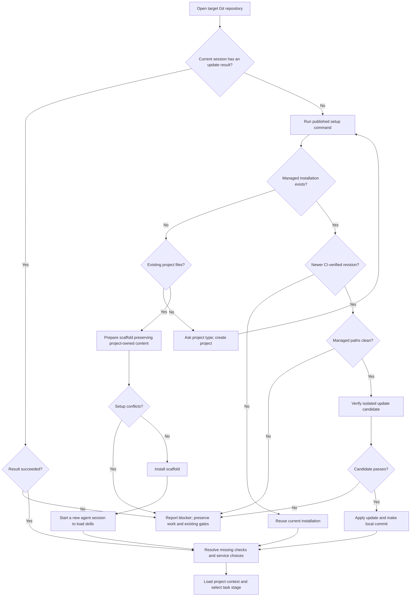
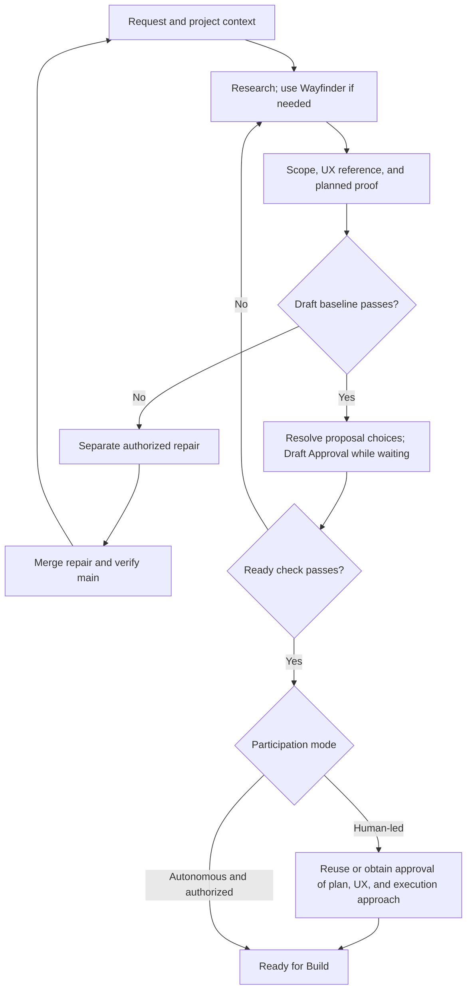
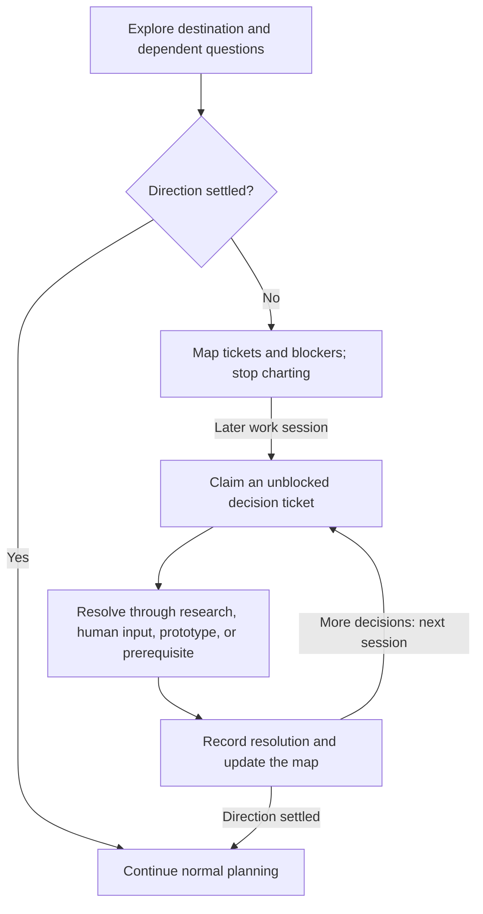
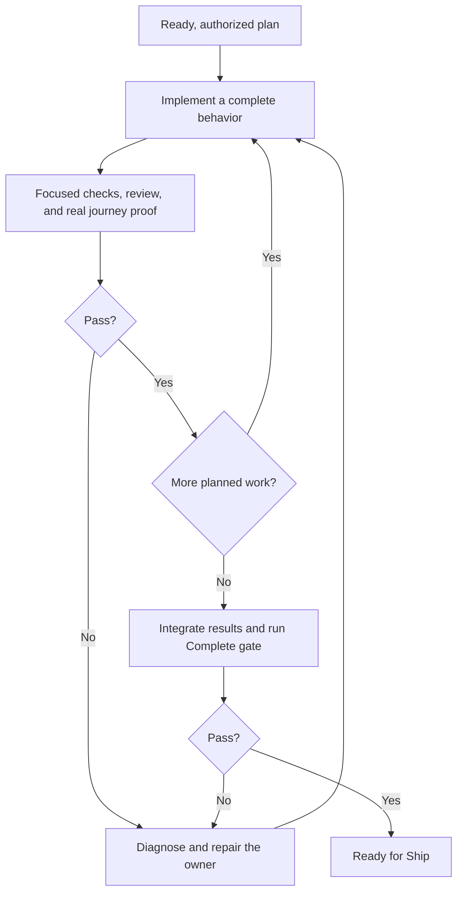
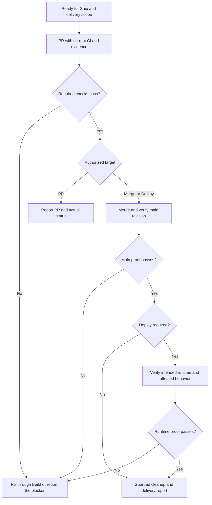
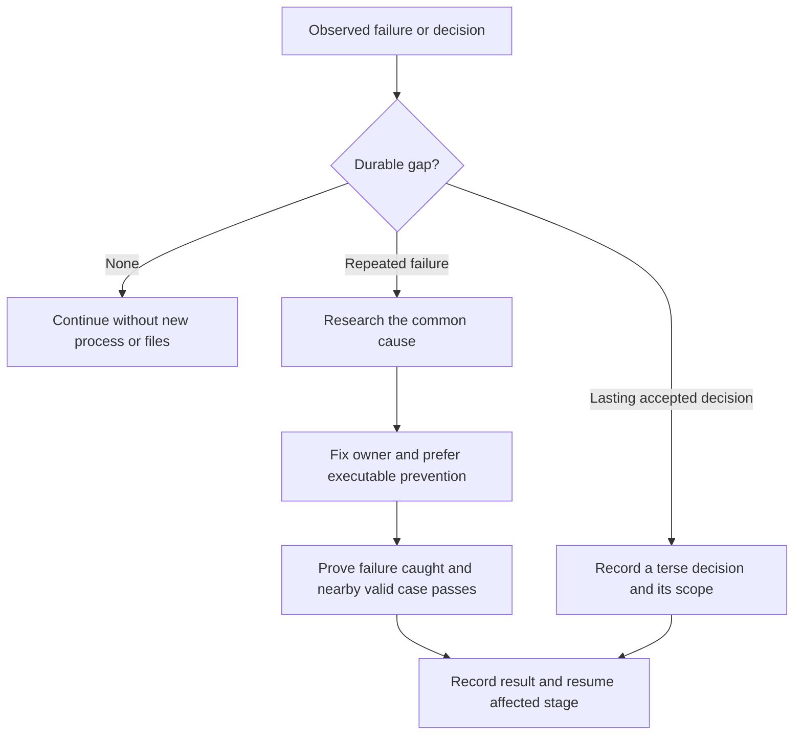
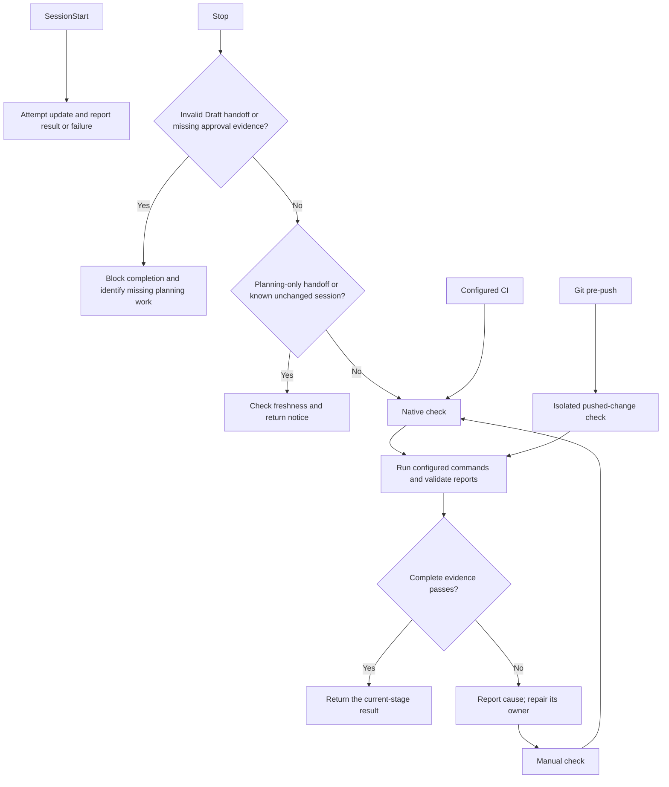

# Hard Eng

**An alpha workflow for one developer building with coding agents.**

Hard Eng adds planning skills, project checks, and delivery verification to your repository. It preserves project instructions and carries work through **Setup → Plan → Build → Ship**, with **Learn** when a lasting fix or decision is needed.

> **Alpha:** supported hooks and application acceptance still have limits. [Verified behavior and open gaps](DECISION.md#current-status).

[Setup](#1-setup-and-session-start) · [Plan](#2-plan) · [Build](#3-build) · [Ship](#4-ship) · [Learn](#5-learn) · [Checks](#the-gate-contract) · [Enforcement](#what-is-actually-enforced)

## 1. Setup and session start

Run this from the target repository's Git root:

```sh
curl -fsSL https://raw.githubusercontent.com/sgaabdu4/hard-eng/main/setup.sh | sh
```

| Starting point | What happens |
| --- | --- |
| Empty repository | Setup stops. The agent asks which project type to create (Python, Flutter, Next.js or OpenNext on Cloudflare) unless the request says, creates it, then reruns setup. New Flutter apps use Riverpod. |
| New project | Install the scaffold; establish product/design context, checks, and intended integrations. |
| Existing project | Preserve custom instructions, skills, hooks, and configuration; report genuine conflicts. |
| Hard Eng already installed | Select a newer CI-verified revision when available, verify an isolated candidate, then apply changes and create a local update commit. |

Setup prepends rules to `AGENTS.md` and connects `CLAUDE.md`. It configures Context Mode, Codebase Memory, and applicable Appwrite, Sentry, Dart, and Marionette connections; Marionette is registered for every Flutter app, pinned to the `pubspec.lock` version of `marionette_flutter` when present. The Appwrite and Flutter skills install only when the project imports Appwrite or contains Dart; updates remove an unedited copy that no longer applies. Reuse known service and hosting choices; resolve missing choices and verify a real call before relying on an integration. The installer/updater never pushes.


```mermaid
flowchart TD
  A[Open target Git repository] --> B{Current session has an update result?}
  B -->|Yes| R{Result succeeded?}
  B -->|No| C[Run published setup command]
  C --> D{Managed installation exists?}
  D -->|No| E{Existing project files?}
  E -->|No| N[Ask project type; create project]
  N --> C
  E -->|Yes| P[Prepare scaffold preserving project-owned content]
  P --> F{Setup conflicts?}
  F -->|Yes| X[Report blocker; preserve work and existing gates]
  F -->|No| I[Install scaffold]
  D -->|Yes| V{Newer CI-verified revision?}
  V -->|No| H[Reuse current installation]
  V -->|Yes| M{Managed paths clean?}
  M -->|No| X
  M -->|Yes| T[Verify isolated update candidate]
  T --> Q{Candidate passes?}
  Q -->|No| X
  Q -->|Yes| U[Apply update and make local commit]
  R -->|No| X
  R -->|Yes| Z[Resolve missing checks and service choices]
  I --> S[Start a new agent session to load skills]
  S --> Z
  H --> Z
  U --> Z
  Z --> W[Load project context and select task stage]
```

Trusted SessionStart hooks attempt the update; without a result, agent instructions require the command above before work. Reuse a current result and never run concurrent setup. A failed update does not waive existing checks.

In Codex CLI, use `codex --enable hooks`, trust the project, then `/hooks` to review and trust Hard Eng's hooks. Changed hook definitions need review again. `--yolo` disables sandbox/approval protections; it is not hook setup. A disabled SessionStart cannot warn you itself; Codex supplies the hook-trust warning. [Native hook instructions](https://learn.chatgpt.com/docs/hooks#review-and-trust-hooks).

Requires Git, curl, uv, Python 3.12+, and the project's SDKs/package manager. Dart Decimate provisioning needs npm 11.16+. Details: [entry command](setup.sh), [installer](setup.py), [integrations](.agents/skills/he/references/integrations.md).

## 2. Plan

The `he` skill tells the agent to select the appropriate stage; you do not need to invoke skills by name. Reuse an existing Ready plan. New work starts with the request, accepted decisions, and product/design context, recorded in one `PLAN.md`.

[HE Plan](.agents/skills/he-plan/SKILL.md) covers:

1. **Research:** inspect the codebase, compare relevant options, and verify current external facts through primary sources. Test consequential assumptions with the cheapest useful investigation or authorized prototype.
2. **Scope and decisions:** define outcomes, boundaries, and the smallest execution arrangement. Ask only unresolved material questions. Parallel work needs named owners and an integration check.
3. **UX:** show the relevant flow using a lightweight mock grounded in the actual website/design system, or an isolated actual-app preview. Label which it is; record owners, rendering and inspection. A dashboard shell does not cover unseen decision-bearing workflows. Actual-app captures need a real baseline; mocks may explain its absence.
4. **E2E:** name the actual journey and expected result, or explain inapplicability. Unchanged appearance does not waive interaction testing; missing or failed proof stays blocked.
5. **Readiness:** run the Draft baseline gate after planning/preview work, then the Ready gate. A failed baseline needs a separate authorized repair delivered through verified main before feature work resumes.


```mermaid
flowchart TD
  A[Request and project context] --> B[Research; use Wayfinder if needed]
  B --> C[Scope, UX reference, and planned proof]
  C --> D{Draft baseline passes?}
  D -->|No| R[Separate authorized repair]
  R --> V[Merge repair and verify main]
  V --> A
  D -->|Yes| J[Resolve proposal choices; Draft Approval while waiting]
  J --> E{Ready check passes?}
  E -->|No| B
  E -->|Yes| F{Participation mode}
  F -->|Human-led| G[Reuse or obtain approval of plan, UX, and execution approach]
  G --> H[Ready for Build]
  F -->|Autonomous and authorized| H
```

For new feature work, reuse your participation choice or ask once. **Human-led** work gets one combined proposal approval; **autonomous** work continues within existing authority. Neither mode invents answers or expands delivery scope. Announce **Ready for Build** only when readiness and authorization are established.

### Optional: Wayfinder

[Wayfinder](.agents/skills/he-plan/references/wayfinding.md) handles dependent unresolved decisions or an explicit request. A settled direction needs no map. Otherwise it maps the destination, questions, blockers, and research, human-choice, prototype, or prerequisite tickets.

Charting stops after preparing the map. Later sessions resolve one decision ticket at a time, except research; authorized independent research may run in parallel. Human-choice and prototype decisions need your answer or verdict. Once direction is clear, return to normal planning. Use an existing authorized tracker or local Markdown, without installing another tracker.

[Research](.agents/skills/research/SKILL.md) supplies evidence; [Codebase Design](.agents/skills/codebase-design/SKILL.md) helps with architecture/domain questions; [UX guidance](.agents/skills/he-plan/references/ux.md) covers lightweight mocks and actual-app previews.


```mermaid
flowchart TD
  A[Explore destination and dependent questions] --> B{Direction settled?}
  B -->|Yes| P[Continue normal planning]
  B -->|No| M[Map tickets and blockers; stop charting]
  M -->|Later work session| T[Claim an unblocked decision ticket]
  T --> R[Resolve through research, human input, prototype, or prerequisite]
  R --> U[Record resolution and update the map]
  U -->|Direction settled| P
  U -->|More decisions: next session| T
```

## 3. Build

[HE Build](.agents/skills/he-build/SKILL.md) implements the authorized plan in a task branch/worktree. Build complete behaviors, review the diff, run focused checks and planned [E2E](.agents/skills/e2e/SKILL.md), and compare UI with the accepted reference.


```mermaid
flowchart TD
  A[Ready, authorized plan] --> B[Implement a complete behavior]
  B --> C[Focused checks, review, and real journey proof]
  C --> D{Pass?}
  D -->|No| E[Diagnose and repair the owner]
  E --> B
  D -->|Yes| F{More planned work?}
  F -->|Yes| B
  F -->|No| G[Integrate results and run Complete gate]
  G --> H{Pass?}
  H -->|No| E
  H -->|Yes| I[Ready for Ship]
```

One coordinator integrates parallel work and owns shared Git changes. Record actual local proof in the same plan before marking it Complete. Only deployment-dependent E2E may remain pending, under a Deploy target with a configured runtime verifier. Announce **Ready for Ship** after the Complete gate passes.

## 4. Ship

[HE Ship](.agents/skills/he-ship/SKILL.md) delivers only your authorized target: **PR, Merge, or Deploy**. Reuse the task branch/PR, review outgoing content for privacy, and verify required CI for the current revision.


```mermaid
flowchart TD
  A[Ready for Ship and delivery scope] --> B[PR with current CI and evidence]
  B --> C{Required checks pass?}
  C -->|No| X[Fix through Build or report the blocker]
  C -->|Yes| D{Authorized target}
  D -->|PR| E[Report PR and actual status]
  D -->|Merge or Deploy| F[Merge and verify main revision]
  F --> G{Main proof passes?}
  G -->|No| X
  G -->|Yes| H{Deploy required?}
  H -->|No| K[Guarded cleanup and delivery report]
  H -->|Yes| I[Verify intended runtime and affected behavior]
  I --> J{Runtime proof passes?}
  J -->|No| X
  J -->|Yes| K
```

For visible work, compare matching before/final states. Publish an image pair only when appearance differs; otherwise record the comparison. Deploy needs the configured runtime verifier. Clean up only after confirmed merge and required delivery proof, preserving unrelated or uncertain worktrees. Local Complete is not delivery.

## 5. Learn

[HE Learn](.agents/skills/he-learn/SKILL.md) runs when a repeated failure or lasting decision needs attention, at whichever stage it occurs.


```mermaid
flowchart TD
  A[Observed failure or decision] --> B{Durable gap?}
  B -->|None| C[Continue without new process or files]
  B -->|Repeated failure| D[Research the common cause]
  D --> E[Fix owner and prefer executable prevention]
  E --> F[Prove failure caught and nearby valid case passes]
  F --> G[Record result and resume affected stage]
  B -->|Lasting accepted decision| H[Record a terse decision and its scope]
  H --> G
```

Prefer fixing the existing invariant, test, checker, or hook. A skill change is a last resort when executable prevention cannot cover the problem. A failed or unavailable prevention test remains an explicit gap.

## The gate contract

Hard Eng discovers supported packages, including monorepos. Each project's `hard-eng.gates.json` supplies commands, reports, budgets, and package relationships. Missing required roles fail configuration; conditional checks apply when the relevant capability is present.

| Stack | Required coverage | Native tools | Conditional or project-configured work |
| --- | --- | --- | --- |
| Python | Formatting, lint, complexity, strict types, annotations, tests with coverage, dead code, duplicate code, dependencies, and performance. | Ruff, Pyrefly, Pytest/coverage, Vulture, jscpd, and Deptry. | Import Linter is required when the package has real Python import roots. |
| JavaScript / TypeScript | Formatting/linting, focused-test detection, types, typing style, tests with coverage, dead code/duplicates, and performance. TypeScript packages also require architectural boundaries. | Biome, TypeScript, the project test/coverage runner, and Fallow. | React adds React Doctor. Existing `build`, integration-test, UI-test, generated-code, boundary, and `check:fallow` scripts must be wired into the package gate with native reports where applicable. |
| Dart / Flutter | Formatting, static analysis, tests with coverage, dead code/duplicates, explicit architectural boundaries, and performance. | Dart format/analyzer, Dart test/coverage, and Dart Decimate. | A Dart boundary rule needs real project prefixes; Flutter build or device proof remains a project requirement. |

All language packages need security checks, lockfile/vulnerability coverage, nonempty tests with **at least 70% executable-line coverage**, and a serial performance suite with a real workload, budget, and native report. Stricter project rules remain. Security may use shared checks; lockfile/vulnerability checks may also use a native workspace owner.

Fill [PRODUCT.md](PRODUCT.md) and [DESIGN.md](DESIGN.md). Handwritten source/test files over 1000 physical lines need a justified exception. Checks validate native reports as well as exits; missing, stale, incomplete, or failing proof does not pass. See this repository's [configuration example](hard-eng.gates.json).

### Shared checks, CI, and delivery

| When present | Required shared coverage |
| --- | --- |
| Every supported repository | Gitleaks source-secret scanning; Git-history secret scanning unless the project explicitly disables it. |
| GitHub Actions workflow | Actionlint and Zizmor workflow-security coverage. |
| Shell scripts | ShellCheck coverage. |
| Deployment configuration | A deployment-configuration check such as Trivy. |
| A delivery request | The project shipping contract: actual PR identity, required CI, applicable UI proof, and a deployment verifier for Deploy. |

Run affected packages, reviewed dependents, and shared checks. Unknown relationships and changes to gate configuration normally require full scope. Parallelize independent checks, cache tool downloads, and retain latest-tool resolution.

Give each CI assertion one owner, preserving its reports, thresholds, and deployment dependencies. Measure pre-push, required CI checks, and total pipeline time. Setup preserves existing workflows; it adds one only when none exists and shipping policy is configured. Details: [gates](.agents/skills/he/references/gates.md), [testing](.agents/skills/he/references/testing.md), [shipping](.agents/skills/he-ship/references/checks.md).

## Security and authority

Semgrep or configured native rules check code; OSV checks selected lockfiles or images. Scanners depend on correct scope and cannot replace server-side access controls or secret rotation.

[Security Review](.agents/skills/security-review/SKILL.md) examines changed trust boundaries. Review outgoing content for secrets, personal data, and private project details. Skills and passing checks never grant authority to publish, spend, or change access.

## What is actually enforced

**Skills guide reasoning; hooks and gates enforce executable checks.** Plan validation checks declared status, results, UX references, and E2E fields. It cannot authenticate screenshots, judge design quality, or prove that an agent followed every instruction.

- **SessionStart:** attempts an update and reports the result or failure.
- **Stop:** distinguishes declared prerequisite clarification from approval handoffs. Approval needs baseline, UX and E2E planning evidence; changed implementation runs native checks. Planning-only or known unchanged sessions may avoid expensive checks. Repeated stop loops are bounded.
- **Pre-push:** verifies pushed revisions in isolated worktrees.
- **CI:** runs configured checks and fails its job on failure.

Explicit Draft/Ready/Complete commands normally run native checks too. Verified scaffold-only updates have a dedicated path that avoids unrelated product checks. Completion and shipping check scaffold freshness. Host hooks work only when supported, trusted, and invoked; registration alone proves nothing.


```mermaid
flowchart TD
  A[SessionStart] --> B[Attempt update and report result or failure]
  C[Stop] --> D{Invalid Draft handoff or missing approval evidence?}
  D -->|Yes| F[Block completion and identify missing planning work]
  D -->|No| P{Planning-only handoff or known unchanged session?}
  P -->|Yes| E[Check freshness and return notice]
  P -->|No| G[Native check]
  H[Manual check] --> G
  I[Git pre-push] --> J[Isolated pushed-change check]
  K[Configured CI] --> G
  G --> L[Run configured commands and validate reports]
  J --> L
  L --> M{Complete evidence passes?}
  M -->|Yes| N[Return the current-stage result]
  M -->|No| O[Report cause; repair its owner]
  O --> H
```

## Read next

- [Product intent and boundaries](PRODUCT.md)
- [Technical component overview](DESIGN.md)
- [Current verification, decisions, and acceptance gaps](DECISION.md#current-status)
- [Research guidance](.agents/skills/research/SKILL.md)
