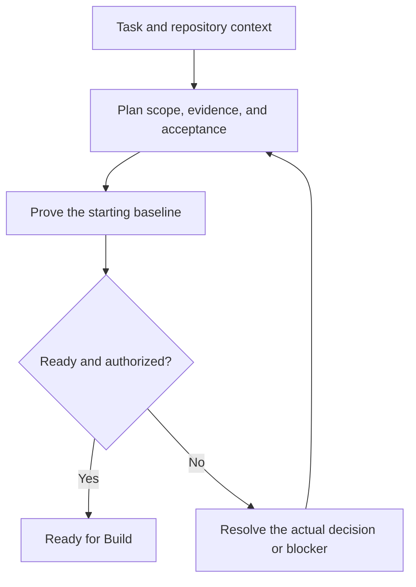
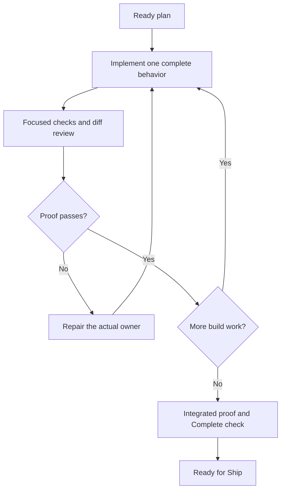
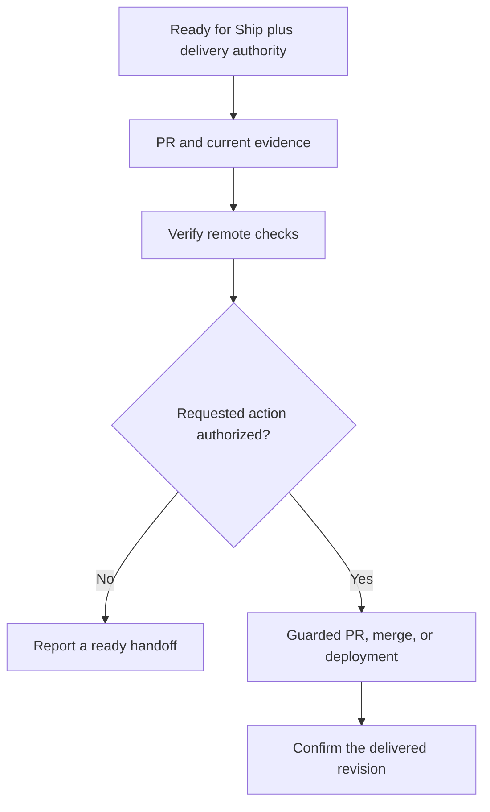
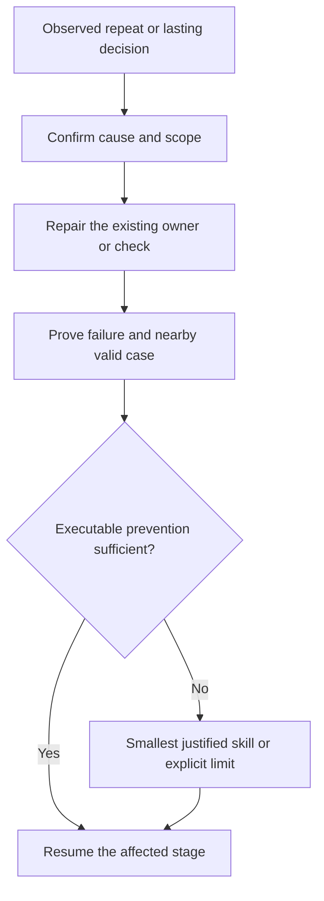
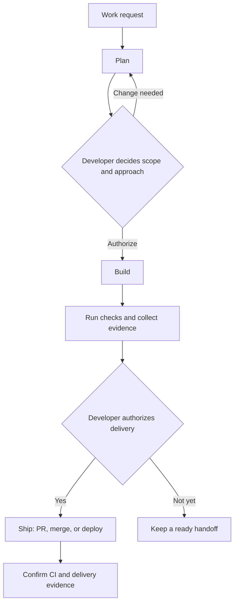
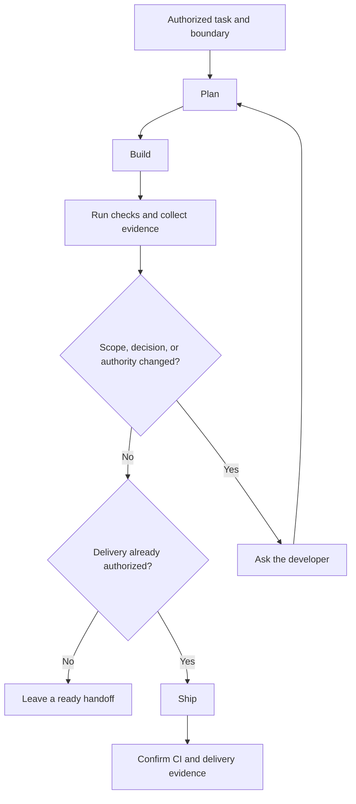
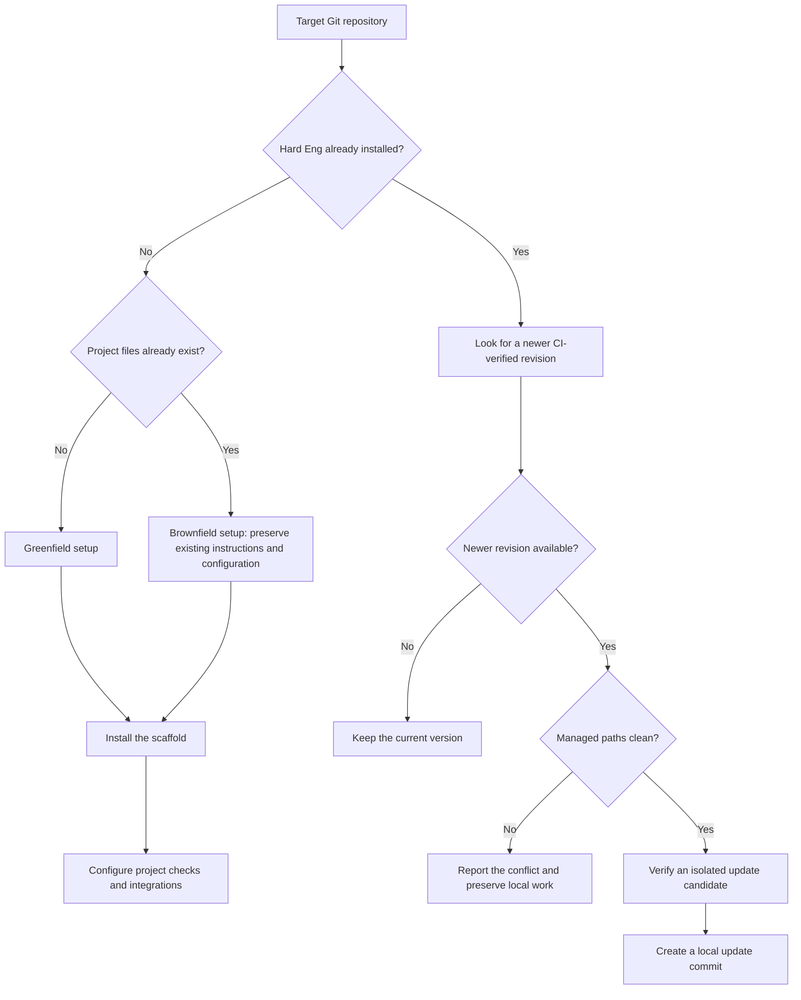
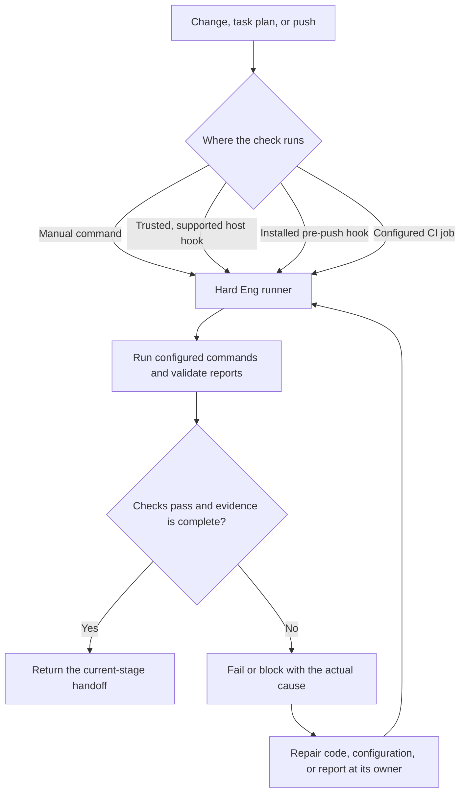

# Hard Eng

**An alpha engineering workflow for one developer building with coding agents.**

Hard Eng lives inside an existing repository. It helps turn a task into a clear plan, a checked build, and delivery evidence—while keeping the developer responsible for the decisions that matter.

It adds shared instructions, skills, project checks, and optional native integrations. It preserves project-owned instructions and configuration, reports conflicts instead of overwriting them, and never pushes on its own.

> **Alpha** — the supported scaffold and checks are still evolving. A successful install or local check is useful evidence, not proof that every host ran a hook, every user journey works, or a release reached production. See [current verification and open limits](DECISION.md#current-status).

[Install](#install-in-a-target-repository) · [Workflow](#the-work-loop) · [Gates](#what-gets-checked) · [Security](#security-and-approval-boundaries) · [Enforcement](#how-enforcement-works)

## What it is for

Hard Eng is designed for a solo developer who wants an agent to carry routine work forward without blurring responsibility.

| Part | What it does |
| --- | --- |
| **Setup and updates** | Adds the scaffold to a target repository from a CI-verified source revision. Existing instructions, skills, hooks, and configuration are preserved; genuine conflicts are surfaced for review. |
| **Project context** | Keeps the product, design, task plan, and ownership boundaries visible to the agent through files such as [PRODUCT.md](PRODUCT.md), [DESIGN.md](DESIGN.md), and `PLAN.md`. |
| **Stage skills** | Routes work to focused planning, build, shipping, research, review, and verification guidance. |
| **Checks and evidence** | Runs configured native commands, examines their reports, and records what has actually been proved. A passing command cannot turn an unverified claim into a fact. |
| **Native integrations** | Can register agent-session, Git pre-push, CI, and applicable development-tool connections. Their activation depends on the host client, its trust settings, and its supported behavior. |

Hard Eng is a repository-local scaffold, not a global agent directory or a product-management system. It does not decide the product, invent requirements, grant approval, or replace real testing and release checks.

## The work loop

The main `he` skill routes a task automatically from its current stage:

| Task situation | Route |
| --- | --- |
| New work or a material scope change | [HE Plan](.agents/skills/he-plan/SKILL.md) |
| An authorized, ready plan | [HE Build](.agents/skills/he-build/SKILL.md) |
| A requested PR, merge, or deployment | [HE Ship](.agents/skills/he-ship/SKILL.md) |
| A repeated failure or a lasting decision | [HE Learn](.agents/skills/he-learn/SKILL.md) |

## The stage skills, explained

### HE Plan — make the work buildable

**Inputs:** the requested outcome, repository context, and settled decisions. **Work:** define scope, acceptance evidence, UX references where needed, and the smallest execution arrangement; prove the current baseline before implementation. **Completion:** a ready plan with any material blockers resolved. **Handoff:** **Ready for Build** only when the plan, baseline, and authorization are all real.


```mermaid
flowchart TD
  A[Task and repository context] --> B[Plan scope, evidence, and acceptance]
  B --> C[Prove the starting baseline]
  C --> D{Ready and authorized?}
  D -->|Yes| E[Ready for Build]
  D -->|No| F[Resolve the actual decision or blocker]
  F --> B
```

A failed baseline takes the authorized prerequisite-repair route: fix and verify that repair on main before resuming the feature. Human-led planning presents the completed proposal for approval. Autonomous planning advances once the task already authorizes it, while still stopping for unresolved material choices, external authority, or missing proof.

### HE Build — implement and prove locally

**Inputs:** a Ready, authorized plan and its baseline evidence. **Work:** deliver connected behavior in focused slices, review the real diff, and run the required local checks and journeys. **Completion:** the plan is Complete with actual verification evidence. **Handoff:** **Ready for Ship** means local implementation is proved; it is not a push, merge, or deployment.


```mermaid
flowchart TD
  A[Ready plan] --> B[Implement one complete behavior]
  B --> C[Focused checks and diff review]
  C --> D{Proof passes?}
  D -->|No| E[Repair the actual owner]
  E --> B
  D -->|Yes| F{More build work?}
  F -->|Yes| B
  F -->|No| G[Integrated proof and Complete check]
  G --> H[Ready for Ship]
```

### HE Ship — prove the remote outcome

**Inputs:** Ready-for-Ship local evidence and the developer's explicit delivery scope. **Work:** prepare the task branch and PR, verify the current remote checks and applicable UI or deployment evidence, then perform only authorized delivery actions. **Completion:** the PR, merge, or deployment has the proof required by the project. **Handoff:** report the actual remote outcome or the exact blocker and resume condition.


```mermaid
flowchart TD
  A[Ready for Ship plus delivery authority] --> B[PR and current evidence]
  B --> C[Verify remote checks]
  C --> D{Requested action authorized?}
  D -->|No| E[Report a ready handoff]
  D -->|Yes| F[Guarded PR, merge, or deployment]
  F --> G[Confirm the delivered revision]
```

### HE Learn — prevent a proven repeat

**Inputs:** repeated failure evidence or a lasting accepted decision. **Work:** confirm the common cause, repair it at the narrowest owner, and prefer a deterministic check over new process. **Completion:** the original failure is blocked, a nearby valid case still works, or the remaining limit is explicit. **Handoff:** record durable decisions tersely and return to the affected stage.


```mermaid
flowchart TD
  A[Observed repeat or lasting decision] --> B[Confirm cause and scope]
  B --> C[Repair the existing owner or check]
  C --> D[Prove failure and nearby valid case]
  D --> E{Executable prevention sufficient?}
  E -->|Yes| F[Resume the affected stage]
  E -->|No| G[Smallest justified skill or explicit limit]
  G --> F
```

### Human-led work


```mermaid
flowchart TD
  A[Work request] --> B[Plan]
  B --> C{Developer decides scope and approach}
  C -->|Authorize| D[Build]
  C -->|Change needed| B
  D --> E[Run checks and collect evidence]
  E --> F{Developer authorizes delivery}
  F -->|Yes| G[Ship: PR, merge, or deploy]
  F -->|Not yet| H[Keep a ready handoff]
  G --> I[Confirm CI and delivery evidence]
```

Use this loop when the developer wants to review meaningful choices before the agent proceeds. The agent can research, draft, implement, and verify within the accepted task, but it pauses for a real scope decision or an external action that has not been authorized.

### Autonomous work within a boundary


```mermaid
flowchart TD
  A[Authorized task and boundary] --> B[Plan]
  B --> C[Build]
  C --> D[Run checks and collect evidence]
  D --> E{Scope, decision, or authority changed?}
  E -->|No| F{Delivery already authorized?}
  E -->|Yes| G[Ask the developer]
  G --> B
  F -->|No| H[Leave a ready handoff]
  F -->|Yes| I[Ship]
  I --> J[Confirm CI and delivery evidence]
```

Autonomy means the agent keeps moving through the authorized loop. It does not mean it can extend the task, choose a meaningful product trade-off, merge, publish, spend money, change access, or claim delivery without the required authority and evidence.

## What gets checked

Hard Eng discovers supported packages and uses their existing commands alongside configured checks. It supports Python, JavaScript/TypeScript, and Dart/Flutter repositories, including monorepos.

Its baseline policy expects meaningful product and design context, nonempty tests, at least 70% executable-line coverage, and a configured performance suite; stricter project requirements remain in place.

Hard Eng discovers source roots and package managers, but the project supplies the real commands and budgets. **Required** means a configured language package is rejected without that role. **Conditional** means the check becomes required only when the project declares or uses the relevant capability.

| Stack | Required gate roles and purpose | Native tools | Conditional or project-configured work |
| --- | --- | --- | --- |
| Python | Formatting, lint, complexity, strict types, annotations, tests, dead code, duplicate code, dependencies, and performance. | Ruff, Pyrefly, pytest with coverage, Vulture, jscpd, and Deptry. | Import Linter is required when the package has real Python import roots. |
| JavaScript / TypeScript | Formatting/linting, focused-test detection, types, typing style, tests, dead code/duplicates, and performance. TypeScript packages also require architectural boundaries. | Biome, TypeScript, project test and coverage commands, and Fallow. | React adds React Doctor. Existing `build`, integration-test, UI-test, generated-code, boundary, and `check:fallow` scripts must be wired into the package gate with their native reports where applicable. |
| Dart / Flutter | Formatting, static analysis, tests with coverage, dead code/duplicates, explicit architectural boundaries, and performance. | Dart format and analyzer, Dart test/coverage, and Dart Decimate. | A Dart boundary rule needs real project prefixes; the tool will not accept a blanket glob. Flutter-specific build or device proof remains a project requirement. |

Every language package also needs security, lockfile, and vulnerability coverage, either directly or through its declared workspace owner. Security uses Semgrep or the configured language-native rule. Performance is never an empty placeholder: it must be serial and emit a supported native report. Existing build, integration, UI, generator, and boundary scripts become part of the contract only when the project already declares them.

Across the repository, [PRODUCT.md](PRODUCT.md) and [DESIGN.md](DESIGN.md) must have their required, filled sections, and handwritten source or test files over 700 physical lines need a justified exception. The runner validates reports as well as exits: missing, malformed, stale, incomplete, skipped, or failing evidence does not pass.

### Shared checks, CI, and delivery

These are separate from a package's language matrix:

| When present | Required shared coverage |
| --- | --- |
| Every supported repository | Source-secret scanning; Git-history secret scanning unless the project explicitly disables it. |
| GitHub Actions workflow | Actionlint and Zizmor workflow-security coverage. |
| Shell scripts | ShellCheck coverage. |
| Deployment configuration | A deployment-configuration check such as Trivy. |
| A delivery request | The project's shipping contract: actual PR identity, required CI checks, applicable UI proof, and a deployment verifier when the target is Deploy. |

Checks cover affected packages, their declared dependents, and shared concerns; uncertain impact runs everything. Independent checks can run in parallel. CI and pre-push must stay within the project's measured time budgets, and cached tool downloads never replace check results.

Setup preserves existing workflows. It adds a new workflow only when the project has measured shipping policy, and it does not turn a local gate pass into CI, merge, or deployment proof.

Read the [gate contract](.agents/skills/he/references/gates.md), [testing guidance](.agents/skills/he/references/testing.md), and [shipping contract](.agents/skills/he-ship/references/checks.md) before treating a green result as release-ready.

## Security and approval boundaries

Hard Eng checks the security work a repository has configured. It does not become the repository's access-control system or promise that a scan makes an application safe.

| Concern | What Hard Eng can enforce | What still needs judgment or product controls |
| --- | --- | --- |
| Secrets | Gitleaks checks source files and, when configured, Git history. | A scan cannot revoke an exposed secret or find every copy outside the scanned scope. |
| Dependencies and images | OSV checks selected lockfiles or images and rejects reported vulnerabilities, errors, and incomplete reports. | The project must select the right lockfiles and images; a clean scan does not prove exploitability or complete coverage. |
| Code, workflow, and deployment configuration | Configured Semgrep, Actionlint, Zizmor, ShellCheck, and deployment checks reject their findings, errors, or incomplete reports. | Scan rules and scope must match the real trust boundary. |
| Permissions and external actions | The workflow keeps task authorization separate from agent participation. It does not grant the agent permission to merge, publish, spend, change access, or handle sensitive data. | Applications must enforce their own identity, role, tenant, and data rules at the real server or service boundary. |

Run [Security Review](.agents/skills/security-review/SKILL.md) when a change crosses a trust boundary. It traces the sensitive asset, caller, required permission, and enforcing code; scanner success alone is never an application security certificate.

## Install in a target repository

Run this from the Git root of the repository you want to set up:

```sh
curl -fsSL https://raw.githubusercontent.com/sgaabdu4/hard-eng/main/setup.sh | sh
```

The same command installs a new scaffold or updates an existing recorded installation. It uses a CI-verified source revision, creates a local update commit when configuration changes, and does not push it. Review any reported conflicts before proceeding.

Setup prepends shared rules to `AGENTS.md` and connects `CLAUDE.md` while preserving existing project instructions, skills, and custom hooks. It configures Context Mode and Codebase Memory, plus applicable Appwrite, Sentry, Dart, and Marionette connections. Known service settings are reused; missing choices remain pending instead of being guessed. See [integration setup](.agents/skills/he/references/integrations.md) for service choices and connection verification.

Trusted session hooks report the startup update result. If that session has no result, the agent's instructions require this command before work. Reuse an existing result; do not run setup concurrently in the background. Completion and shipping also check that the installed scaffold is current.

It needs Git, curl, uv, and Python 3.12 or later. Running the resulting checks also needs the project’s own SDKs and pnpm where applicable; Dart Decimate provisioning requires npm 11.16 or later.

Then run the installed project’s configured check:

```sh
python3 .hooks/hard-eng.py check
```

For a deeper installation and update contract, see [setup.sh](setup.sh), [setup.py](setup.py), and the [integration guidance](.agents/skills/he/references/integrations.md). New or changed hooks still need to be trusted by the relevant client; registration alone does not prove they executed.

## Setup and update paths


```mermaid
flowchart TD
  A[Target Git repository] --> B{Hard Eng already installed?}
  B -->|No| C{Project files already exist?}
  C -->|No| D[Greenfield setup]
  C -->|Yes| E[Brownfield setup: preserve existing instructions and configuration]
  D --> F[Install the scaffold]
  E --> F
  F --> G[Configure project checks and integrations]
  B -->|Yes| H[Look for a newer CI-verified revision]
  H --> I{Newer revision available?}
  I -->|No| J[Keep the current version]
  I -->|Yes| K{Managed paths clean?}
  K -->|No| L[Report the conflict and preserve local work]
  K -->|Yes| M[Verify an isolated update candidate]
  M --> N[Create a local update commit]
```

Greenfield and brownfield setup use the same installer. Brownfield setup keeps project-owned files and asks for a decision on a genuine overlap. An existing installation updates only from a verified revision, verifies the candidate before changing managed paths, and never pushes the resulting local commit.

## How enforcement works


```mermaid
flowchart TD
  A[Change, task plan, or push] --> B{Where the check runs}
  B -->|Manual command| C[Hard Eng runner]
  B -->|Trusted, supported host hook| C
  B -->|Installed pre-push hook| C
  B -->|Configured CI job| C
  C --> D[Run configured commands and validate reports]
  D --> E{Checks pass and evidence is complete?}
  E -->|Yes| F[Return the current-stage handoff]
  E -->|No| G[Fail or block with the actual cause]
  G --> H[Repair code, configuration, or report at its owner]
  H --> C
```

The runner does not accept a green exit alone: it checks required reports and their scope. A failed manual check blocks a readiness claim; an invoked pre-push hook checks the commits being pushed; and a configured CI job fails its own run. A host hook helps only when that client supports and trusts it. None of these paths grants new authority or proves complete application acceptance.

## Skills at a glance

| Need | Guidance |
| --- | --- |
| Keep task context and choose a stage | [Hard Eng](.agents/skills/he/SKILL.md) |
| Research a codebase or a current external fact | [Research](.agents/skills/research/SKILL.md) |
| Review code, design, security, or real journeys | [Code Review](.agents/skills/code-review/SKILL.md), [Codebase Design](.agents/skills/codebase-design/SKILL.md), [Security Review](.agents/skills/security-review/SKILL.md), [E2E](.agents/skills/e2e/SKILL.md), [Product Walkthrough Video](.agents/skills/product-walkthrough-video/SKILL.md) |
| Work with Appwrite or Flutter | [Appwrite Backend](https://github.com/sgaabdu4/appwrite-backend), [Building Flutter Apps](https://github.com/sgaabdu4/building-flutter-apps) |
| Author or improve a skill | [Writing Great Skills](.agents/skills/writing-great-skills/SKILL.md) |

Skills guide judgment. The checks enforce only their documented, executable contracts.

## Evidence, CI, and the alpha boundary

Hard Eng distinguishes three things:

1. **A local result** shows what the configured command reported in this checkout.
2. **Delivery evidence** connects a task to its actual pull request, required CI, UI proof when applicable, and deployment verification when configured.
3. **Human judgment** remains necessary for product correctness, realistic test behavior, user authority, client hook trust, and acceptance on real devices or services.

The source suite and installer fixtures verify supported behavior, but they cannot guarantee third-party host activation, scanner completeness, application-specific UI or service acceptance, or every consumer’s release lifecycle. The maintained record of what has been verified and what remains open is [DECISION.md](DECISION.md#current-status).

## Read next

- [Product intent and boundaries](PRODUCT.md)
- [Technical component overview](DESIGN.md)
- [Current verification, decisions, and acceptance gaps](DECISION.md#current-status)
- [Planning, build, and shipping workflow](.agents/skills/he/references/workflow.md)
